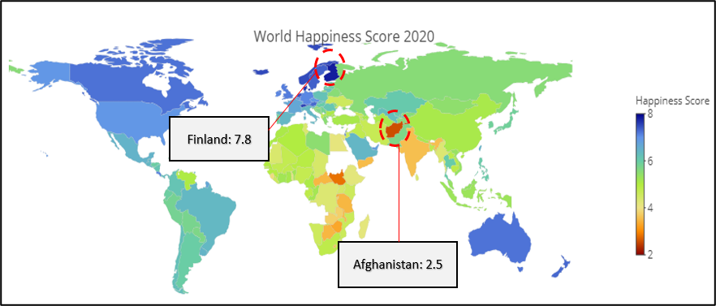
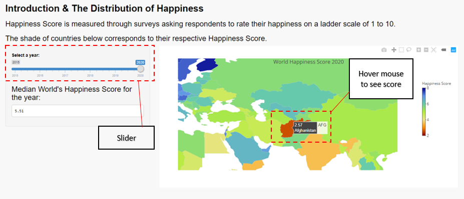
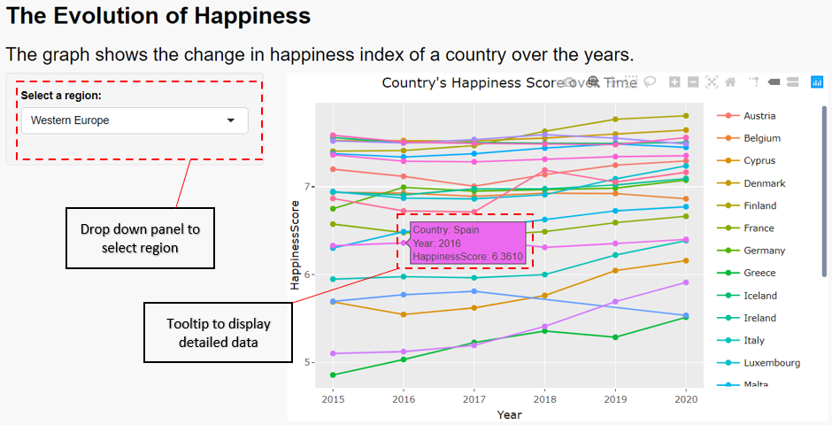
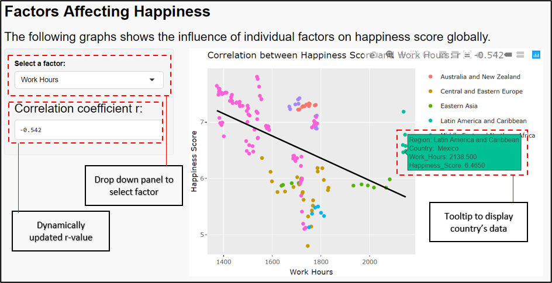
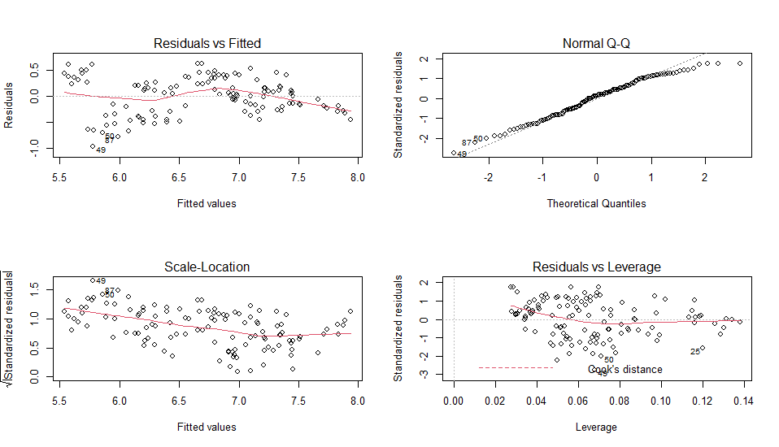
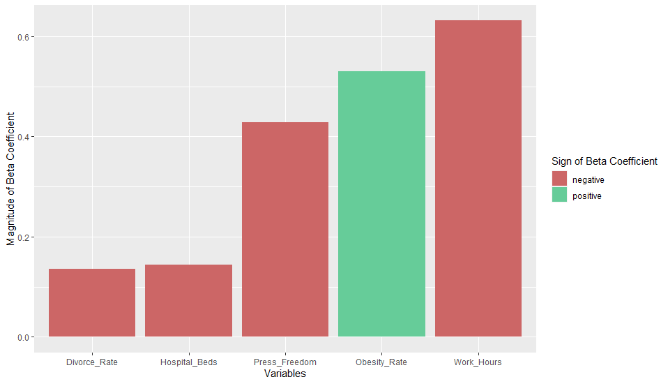
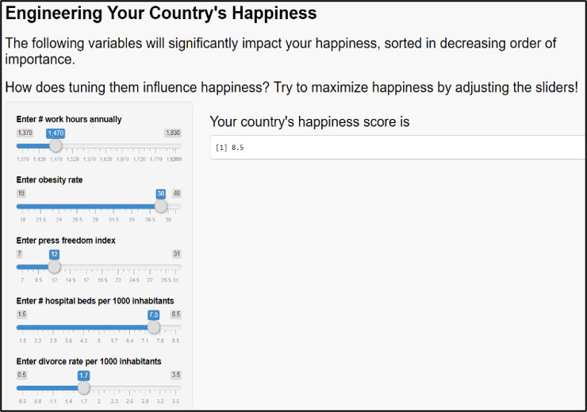

The Math of Happiness: An analysis of factors that influence happiness. 
---------------------------------------------------------------------

By: Ang Su Yiin, Anne Nguyen Nhi Thai An, E-Lynn Toh, Foo Kai Loon, Sean Samuel Prajs, Tay Kai Lin  

*These reports were written as part of the requirements for the Applied Statistical Analysis with R module for [MITB](https://scis.smu.edu.sg/master-it-business).*

---

Shiny app available at [The Math of Happiness](https://suyiinang.shinyapps.io/MathofHappiness/)

---

## 1. Introduction
The quest for happiness is an elusive pursuit for many. Between 2005 and 2015, the[ World Health Organization (WHO) reported a global 18.4% rise in depression](https://www.familyaware.org/who-2017-depression-report/), the most common mental health disorder. In Singapore, [a study by Singapore Mental Health Study (SMHS)](https://www.imh.com.sg/uploadedFiles/Newsroom/News_Releases/SMHS%202016_Media%20Release_FINAL_web%20upload.pdf) in 2016 revealed a consistent trend, where 1 in 7 of Singapore residents have experienced a form of mental disorder in their lifetime, an increase from 12% in 2010 . In 2020, the emergence of Covid-19 has caused a steep increase in unhappiness, where [a study by JAMA Network](https://jamanetwork.com/journals/jamanetworkopen/fullarticle/2770146) found that the prevalence of depression symptoms in US adults were 3 times higher during Covid-19 compared with before Covid-19 . Going forward, JAMA’s study foresees a rise in mental health issues to follow post Covid-19.
In view of how happiness seems to be on a decline in the world, his study aims to (i) understand factors that affect happiness, and (ii) suggest solutions for the governments and/or individuals to adopt to [improve mental health, thus increasing happiness](https://www.caba.org.uk/help-and-guides/information/happiness-depends-mental-health#:~:text=According%20to%20the%20Origins%20of,increase%20happiness%20by%20only%205%25). We will investigate the relationship between countries’ happiness (as measured in the Happiness Index by the United Nations) and other factors such as lifestyle, technology, health, and others.

## 2. Overall Concept
### 2.1 Overview
Currently, gross domestic product (GDP) and gross national product (GNP) per capita remain as commonly used indicators of a nation’s standard of living and thereby societal satisfaction. However, while per-capita wealth can increase happiness, these increases [diminish beyond certain levels of wealth]( https://hbr.org/2012/01/the-economics-of-well-being), suggesting that there are possibly other factors that determine happiness beyond the information that standard absolute measures of wealth that GDP and GNP provide. It has also been highly debated about whether happiness is the responsibility of the state or the individual. One interpretation by psychologist Ed Diener believes that [happiness is be the responsibility of both](https://greatergood.berkeley.edu/article/item/why_governments_should_care_more_about_happiness); while individuals should take personal responsibility for their happiness, the state is vital in providing the environment for happiness to grow. 

Regardless of the subjectivity of happiness and who is responsibility for it, happiness is generally perceived as desirable and valuable. Happy people tend to live healthier and longer lives. Conversely, unhappiness is an area of concern. For this report, we will be using the Happiness Index to measure happiness as an alternative to traditional economic measures. **We will also be emphasizing on the role of the state in influencing the happiness levels of a country, more than the individual.** 

### 2.2 Purpose and target audience  
The purpose of this report is to explore the correlation of esoteric factors involving economic, health, social, lifestyle, political/legal, environmental, and technological with societal happiness using statistical analysis. The target audience is governments in developed countries. We have limited to developed countries as these countries have more data available. 

### 2.3 Overall Methodology  
In order to establish a baseline, the annual [World Happiness Report (WHR)](https://worldhappiness.report/ed/2020/#read) from 2015 to 2020 will be used to form ranked comparisons of national happiness in order to conduct the analysis. The WHR was chosen as the baseline as the report covers how happy citizens perceive themselves to be through independent surveys in collaboration with Gallup. This serves as a neutral scoring outside of governmental surveys for which analysis can be juxtaposed.

In addition, data will be drawn from other external sources to introduce factors for study that are generally unscored from the WHR to analyse their relationship to national happiness based on WHR’s scoring. Examples of factors considered would include availability of healthcare, income inequality and even work hours. As the target audience of this report is for developed nations, data from the Organisation for Economic Co-operation and Development (OECD) will form the mainstay this analysis as the data best fits the described target audience, with its member nations being some of the most developed nations globally. This will allow for better comparison accuracy.

### 2.4 Problem Definition & Solution

The complexity of happiness makes it difficult for governments to know how to increase the happiness levels of their citizens as it is not known what factors will lead to an increase in happiness. 
By analysing various factors ranging from social to healthcare in OECD countries, we aim to perform statistical analysis on OECD countries to investigate the factors that are correlated with happiness. We also aim to produce a model that will give governments directions on how various factors will influence the happiness levels of citizens. 

Key insights and results of the analysis are reproduced on the R Shiny App for public communication purposes. More detailed statistical data is deliberately withheld to not hamper communication to the general public, instead being elaborated on in this technical report. 

## 3. Data Sources, Preparation & Cleaning
### 3.1 Data source
The primary data source comes from the World Happiness Report (retrieved from [Kaggle](https://www.kaggle.com/mathurinache/world-happiness-report). This dataset comes in individual files for the years 2015 to 2020. To explore association with other variables, complementary data sources are obtained for specific countries to be overlaid with the primary dataset, as outlined below. 

| Factor | Category | Data Source |
------ | -------- | ----------- |
| Marriage Rates | Social | Compiled from various sources, retrieved from [Our World in Data](https://ourworldindata.org/marriages-and-divorces) |
| Divorce Rates | Social | Compiled from various sources, retrieved from [Our World in Data](https://ourworldindata.org/marriages-and-divorces) 
| Hospital Beds per capita | Healthcare | Obtained from [OECD](https://data.oecd.org/healtheqt/hospital-beds.htm) |
| Obesity Rate | Healthcare | Obtained from [Kaggle](https://www.kaggle.com/amanarora/obesity-among-adults-by-country-19752016) |
| Wealth Inequality | Economic | Obtained from [OECD](https://data.oecd.org/inequality/income-inequality.htm) |
| Internet Access | Technology | Obtained from [OECD](https://data.oecd.org/ict/internet-access.htm) |
| Press Freedom | Political Climate | Original source from [Reporters without Borders](https://rsf.org/en/ranking_table), retrieved via the Wayback Machine and compiled on [Wikipedia](https://en.wikipedia.org/wiki/Press_Freedom_Index) |
| Work Hours | Lifestyle | Obtained from [OECD](https://data.oecd.org/emp/hours-worked.htm) |

### 3.2 Data Preparation and cleaning 
**3.3.1 Data Compilation**  
With the use of Excel, data from various sources is collated into three CSV files:  
  i)	“merged_happiness.csv” - Happiness Index of all countries from 2015 to 2020, primarily for univariate exploratory data analysis concerning happiness score. The original data was downloaded from Kaggle in 6 separate files for each of the year, and combined together in one file.   
  ii)	“compiled_final.csv” - the variables for OECD countries organized by year, to investigate the effects of various factors on happiness score.   
  iii)	“country_data_revised.csv” – the output of “compiled_final.csv” after data imputation as explained in Section 3.3.2. and restricted to the year 2015-2020 for regression analysis.  

**3.3.2 Data Imputation**  
Due to data completeness issues, preliminary data preparation was required in Excel for the file “compiled_final.csv”. There were 3 ways data was imputed:   
  i)	Where the data was **broadly available historically** with only 1 or 2 years of unrecorded data, the Excel “FILL” function was used instead. This process was repeated along with analytical judgement of data estimates to produce as realistic of estimates as possible.   
  ii)	Where countries with >15 years of historical data, but had **more than 3 years** missing values during our review period (2015 to 2020), historical datapoints were used to estimate the missing values. For example, marriage rate data for Australia for the years 2018-2020 was projected from available data from 2000-2017. This was performed using the **“TREND”** function in Excel, which uses the linear least square method.  
  iii)	There are two rare instances whereby the data was **quite limited** due to lack of data collected over the 20-year period. This was the case for two countries, Canada and New Zealand, for the ‘internet access’ variable. These datapoints were **left blank** as imputing the data would distort the final model.

## 4. Descriptive Statistics 
### 4.1 Distribution of Happiness via interactive choropleth map on Shiny


*Figure 1: Choropleth map showing the global distribution of happiness*  

Our choropleth map displays national levels of happiness score around the world according to a colour scale. From the app, we can easily identify the happiest and least happy country. Using Figure 1 as example, in year 2020 – Finland was the happiest country with a happiness score of 7.8 and Afghanistan with score of 2.5. [Finland ranks first because of its extensive welfare benefits, low levels of corruption, democracy, and leading healthcare system](https://www.happy-or-not.com/en/2020/06/forbes-why-finland-is-the-happiest-country-in-the-world/). In contrast, [Afghanistan and many of the unhappiest countries](https://www.forbes.com/sites/laurabegleybloom/2020/03/20/ranked-20-happiest-countries-2020/?sh=337287e47850) are underdeveloped and have experienced war.

**Shiny App Display**


*Screenshot of Shiny App – Distribution tab*

We used the Plotly package in building this interactive choropleth map. User can hover over their area of interest to see the country and happiness value. Additionally, we have included a slider for users to observe geographic distribution from 2015 to 2020 and the median happiness score of that year. Lastly, a median happiness score is displayed for the selected year for user’s reference.

### 4.2 Evolution of Happiness from 2015 to 2020 via line charts on Shiny  

The evolution tab displays the trendlines of the happiness index from 2015 to 2020. This allows users to observe trends in happiness index for various countries of interest in various regions of the world. Users can select a region from the dropdown, and the reactive output would display the evolution of happiness for those countries, together with tooltip to display data pertaining to individual datapoints.



*Screen shot of shiny app - Evolution tab*  

In the UI, we created a side panel for users to select the region. We created a default setting, “Not Selected”, followed by the list of regions arranged in alphabetical order. The output of the graph plot is for the main panel. 


## 5. Inferential Statistics & Model Building
### 5.1 Correlation – factors affecting happiness
Pair-wise correlation between each of the factors and happiness score is investigated to explore the strength of their linear correlation. The analysis script is in “1_correlation_plots.R”. The data from “country_data_revised.csv” is first loaded, then correlation plot and r value are produced for each factor against happiness (an example for the factor Hospital_Beds is shown here):
```
Final_Data <-read.csv("country_data_revised.csv")
Final_Data_2 <-na.omit(Final_Data)

attach(Final_Data_2)

a <-cor(Hospital_Beds,Happiness,method = c("pearson"))
a
plot(Hospital_Beds,Happiness, main=paste0("Happiness vs Hospital Beds: r = ", signif(a, digits = 3)), xlab = "Hospital Beds", ylab = "Happiness", pch=19)
abline(lm(Happiness~Hospital_Beds,data=Final_Data_2), col="green")
```
*R code for correlation*
  
P-values for the hypothesis test of each of the regression slope for each factor against happiness being significantly different from 0 are also calculated, and collated together with r values in one summary table:  
```
vars <- colnames(Final_Data_2)[4:11]
r <- signif(c(a,b,c,d,e,f,g,h), digits = 3)
p <- c()

for (col in vars) {
  col_obj <- eval(parse(text = col))
  print(col)
  lm_obj <- lm(Happiness ~ col_obj)
  print(summary(lm_obj))
  p <- c(p, summary(lm_obj)$coefficients[2,4])
}

p <- signif(p, digits = 3)
summary_table <- data.frame(vars, r, p)
summary_table
```
*R code for p-value*

Given that all variables, except for marriage rate, have a p-value of less than 0.05, there is statistical evidence to prove that there is a linear relationship between these variables and happiness.

We also observe that some variables are potentially outliers:  
  •	Japan: outlier for Hospital Beds and Obesity Rate  
  •	Mexico: outlier for Gini Coefficient, Internet Access, Press Freedom, and Work Hours  
  •	South Korea: outlier for Hospital Beds, Obesity Rate, and Work Hours  
  •	Turkey: outlier for Press Freedom  


*Correlation of 8 variables and happiness*

**Shiny App Display**  


*Screenshot of Shiny app - Factors*  

Similarly, the Factors tab of our Shiny app displays the correlation scatterplot between every factor and the happiness index. Plots have been colour coded by region. This allows users to observe how every factor affects the Happiness Index across regions in the world. Users can select a factor from the dropdown that they would like to observe. User can also hover over individual datapoint get individual country’s data. The value of the correlation coefficient is dynamically updated with the selected factor and displayed for user to get a sense of the strength of correlation. 

### 5.2 Statistics

In order to come up with suggestions for governments and individuals alike to explain and boost their happiness, a multiple linear regression model is built with the dependent variables being the above-mentioned factors and the independent variable being happiness score.

The multiple linear regression requires data completeness for the year 2015-2020 and for all OECD countries mentioned above across all variables used. While data imputation method using linear least square was employed at for individual countries for each independent variable as mentioned in Section 3.3.2., there is no past data for Internet Access for Canada and New Zealand. These two countries are thus dropped from the regression model building via na.omit function:
```
df <- na.omit(df)
```

Further, the presence of outliers would significantly affect the robustness of the linear regression model built. From earlier examination of linear correlation between individual factors and happiness score via visual inspection of the correlation plots, the following countries are excluded as being potential outliers:
  -	Japan: outlier for Hospital Beds and Obesity Rate
  -	Mexico: outlier for Gini Coefficient, Internet Access, Press Freedom, and Work Hours
  -	South Korea: outlier for Hospital Beds, Obesity Rate, and Work Hours
  -	Turkey: outlier for Press Freedom
These 4 were then excluded from the dataset.
```
df <- df %>% filter(!(Country %in% c('Japan', 'Mexico', 'South Korea', 'Turkey')))
```

After outlier exclusion, the columns ‘Country’ and ‘Year’ were dropped from the data since a general model is built taking datapoints from each country and year combination as an independent observations. The multiple linear regression model would also be affected if there is significant correlation between any two of the independent variables. Multi-collinearity issues were examined via a correlation matrix and displayed in Figure below:
```
df <- df %>% dplyr::select(-Country, -Year)
cor(df)
```
```
                Hospital_Beds Divorce_Rate Gini_Coefficient Internet_Access Marriage_Rate Obesity_Rate Press_Freedom Work_Hours
Hospital_Beds           1.0000      -0.1770           -0.349         -0.1580        0.1040       -0.167        0.2300    -0.0231
Divorce_Rate           -0.1770       1.0000            0.194         -0.0339        0.4290        0.138       -0.2100    -0.1460
Gini_Coefficient       -0.3490       0.1940            1.000         -0.3810        0.1670        0.677        0.4370     0.4600
Internet_Access        -0.1580      -0.0339           -0.381          1.0000        0.0512       -0.226       -0.5560    -0.7340
Marriage_Rate           0.1040       0.4290            0.167          0.0512        1.0000        0.518       -0.0194     0.0527
Obesity_Rate           -0.1670       0.1380            0.677         -0.2260        0.5180        1.000        0.3850     0.4120
Press_Freedom           0.2300      -0.2100            0.437         -0.5560       -0.0194        0.385        1.0000     0.5760
Work_Hours             -0.0231      -0.1460            0.460         -0.7340        0.0527        0.412        0.5760     1.0000
```
*Correlation matrix*

From the above correlation matrix, it could be observed that all correlation coefficients stay below 0.7 except for that between Internet_Access and Work_Hours. Internet_Access was thus dropped from the dataset to eliminate multi-collinearity issue. Internet_Access was chosen instead of Work_Hours because the latter has better data completeness and earlier required less interpolation. 
```
df <- df %>% dplyr::select(-Internet_Access)
cor(df)
```
Stepwise regression method in all forward, backward, and both directions of elimination were employed to come up with the best model for predicting happiness score via the function StepAIC: 

```
fit_all <- lm(Happiness ~ ., data = df)

step_backward <- stepAIC(fit_all, direction ="backward")
fit_none <- lm(Happiness ~ 1, data = df)
step_forward <- stepAIC(fit_none, direction = "forward", scope = list(upper = fit_all, lower = fit_none))
step_both <- stepAIC(fit_none, direction = "both", scope = list(upper = fit_all, lower = fit_none))
```
All three methods arrived at the same model, with summary result as shown in Figure below.
The stepwise regression method did not drop any variable from the original 7 factors, and included 2 variables with low significance: Marriage_Rate and Gini_Coefficient. This is because AIC is a different criterion for selecting significant variables compared to p-value of the coefficient estimates. Further, typically, multi-collinearity issue would also typically be addressed through stepwise regression, but this was already carried out pre-emptively. 
```

Call:
lm(formula = Happiness ~ Work_Hours + Obesity_Rate + Press_Freedom + 
    Hospital_Beds + Divorce_Rate + Marriage_Rate + Gini_Coefficient, 
    data = df)

Residuals:
     Min       1Q   Median       3Q      Max 
-0.97565 -0.27706  0.04824  0.26857  0.63095 

Coefficients:
                  Estimate Std. Error t value Pr(>|t|)    
(Intercept)      11.347234   0.523024  21.695  < 2e-16 ***
Work_Hours       -0.003109   0.000303 -10.261  < 2e-16 ***
Obesity_Rate      0.081422   0.014143   5.757 7.60e-08 ***
Press_Freedom    -0.037791   0.007367  -5.130 1.23e-06 ***
Hospital_Beds    -0.096483   0.023943  -4.030 0.000102 ***
Divorce_Rate     -0.252880   0.081359  -3.108 0.002386 ** 
Marriage_Rate     0.129981   0.051676   2.515 0.013311 *  
Gini_Coefficient -2.185514   1.563054  -1.398 0.164806    
---
Signif. codes:  0 ‘***’ 0.001 ‘**’ 0.01 ‘*’ 0.05 ‘.’ 0.1 ‘ ’ 1

Residual standard error: 0.3649 on 112 degrees of freedom
Multiple R-squared:  0.7583,	Adjusted R-squared:  0.7432 
F-statistic: 50.19 on 7 and 112 DF,  p-value: < 2.2e-16
```
*Summary result of 7-factor model after stepwise regression*

Since stepwise regression did not drop any variable further, and a more parsimonious model would be more desirable with fewer, more significant factors, we proceeded to also drop Marriage_Rate and Gini_Coefficient from the model:
```
df <- df %>% dplyr::select(-Marriage_Rate, -Gini_Coefficient)
fit_final <- lm(Happiness ~ ., data = df)
summary(fit_final)
```

```
Call:
lm(formula = Happiness ~ ., data = df)

Residuals:
     Min       1Q   Median       3Q      Max 
-0.95146 -0.26832  0.01847  0.28449  0.74296 

Coefficients:
               Estimate Std. Error t value Pr(>|t|)    
(Intercept)   10.995041   0.494056  22.255  < 2e-16 ***
Hospital_Beds -0.059079   0.021414  -2.759  0.00676 ** 
Divorce_Rate  -0.193223   0.072677  -2.659  0.00897 ** 
Obesity_Rate   0.091882   0.009924   9.259 1.48e-15 ***
Press_Freedom -0.046378   0.007022  -6.605 1.32e-09 ***
Work_Hours    -0.003169   0.000310 -10.221  < 2e-16 ***
---
Signif. codes:  0 ‘***’ 0.001 ‘**’ 0.01 ‘*’ 0.05 ‘.’ 0.1 ‘ ’ 1

Residual standard error: 0.378 on 114 degrees of freedom
Multiple R-squared:  0.736,	Adjusted R-squared:  0.7244 
F-statistic: 63.55 on 5 and 114 DF,  p-value: < 2.2e-16
```
*Summary result of final 5-factor model*

The result summary of this final model is presented in Figure above. The 5-factor model without Marriage_Rate and Gini_Coefficient do not significantly change the Adjusted R-squared, which only dropped slightly from 0.7432 to 0.7244. Further, the remaining variables in the model now have relatively high significance. It is suggested that dropping Marriage_Rate and Gini_Coefficient made the model parsimonious: these variables are potentially correlated to some other unobserved variables not available in this dataset, but these 2 variables themselves are not strongly correlated with the remaining 5 variables, therefore not significantly affecting the latter’s estimates and significance. 


*Diagnostic plots of 5-factor model*

From the diagnostic plots some issues could be observed with the dataset: the residuals do not totally conform to a normal distribution. This is acknowledged as current limitation with the obtained dataset. 

On the other hand, the lines indicating the mean in the Residuals vs Fitted plot, Scale-Location Plot, and Residuals vs Leverage Plot are approximately horizontal, there is no clear clustering nor heteroscedasticity, and no apparent non-linear relationship. Residuals vs. Leverage plot also indicates that no point lies outside any area indicated by the dotted line with significant Cook’s distance i.e. no data point has significant influence that would adversely change the regression result if they were to be removed. 

The estimates for the regression coefficients in this final model indicate the degree to which a unit change in their magnitude for each variable will effect a change in a unit of happiness score. However, since the 5 independent variables are in different units, comparing the regression coefficient estimates directly would be inaccurate. Beta-coefficients i.e. standardized regression coefficients would make a fairer comparison to conclude which independent variable or factor has a higher influence on the eventual happiness score in this predictive model: 
```
# calculate beta coefficients
std_df <- df %>% mutate(std_Happiness = (Happiness - mean(Happiness)) / sd(Happiness),
              std_Hospital_Beds = (Hospital_Beds - mean(Hospital_Beds)) / sd(Hospital_Beds),
              std_Divorce_Rate = (Divorce_Rate - mean(Divorce_Rate)) / sd(Divorce_Rate),
              std_Obesity_Rate = (Obesity_Rate - mean(Obesity_Rate)) / sd(Obesity_Rate),
              std_Press_Freedom = (Press_Freedom - mean(Press_Freedom)) / sd(Press_Freedom),
              std_Work_Hours = (Work_Hours - mean(Work_Hours)) / sd(Work_Hours)) %>%
  dplyr::select(std_Happiness, std_Hospital_Beds, std_Divorce_Rate, std_Obesity_Rate, std_Press_Freedom, std_Work_Hours)

std_lm <- lm(std_Happiness ~ ., data = std_df)
beta_coefs <- as.data.frame(summary(std_lm)$coefficients[2:6,1])
colnames(beta_coefs) <- "Beta.Coef"
beta_coefs <- beta_coefs %>% rownames_to_column("Variables") %>% arrange(desc(abs(Beta.Coef))) %>%
  mutate(Variables = sub("std_", "", Variables))
``` 
*R code for calculating Beta coefficient*
The beta-coefficients are reported in Table 2, sorted in order of decreasing absolute magnitude i.e. influence on happiness score:

Table 2: Beta-coefficients of the final 5-factor model

| Variables |	Beta Coefficients |
| --------- | ----------------- |
| Work_Hours	| -0.631 |
| Obesity_Rate|	0.530 |
| Press_Freedom|	-0.429 |
| Hospital_Beds	|-0.144 |
| Divorce_Rate	| -0.136 |

To visualize the factors’ relative influence, a bar chart is also generated:
``` 
beta_coefs <- beta_coefs %>% mutate(Sign.Beta.Coef = ifelse(Beta.Coef > 0, "positive", "negative"))

beta_coefs %>% ggplot(aes(reorder(Variables, abs(Beta.Coef)), abs(Beta.Coef), fill = Sign.Beta.Coef)) +
  geom_bar(stat = "identity") +
  scale_fill_manual(values = c("#CC6666", "#66CC99")) +
  xlab("Variables") +
  ylab("Magnitude of Beta Coefficient") +
  labs(fill = "Sign of Beta Coefficient")
``` 
*R Code to visualise the factors' relative influence on happiness*



*Magnitude of Beta-coefficients for 5 variables influencing happiness score*

It can therefore be concluded that amongst all the original 8 factors to be investigated for their roles in influencing happiness, the following 5 factors are the most significant, sorted in order of decreasing importance: work hours, obesity rate, press freedom, hospital beds, and divorce rate. 

**Shiny App Display**

The obtained multiple linear regression model using these 5 factors is also produced to help the audience engineer their happiness score via tweaking the independent variables. Care has been taken to ensure that the input range for the 5 factors is restricted only to what the original input dataset offers, since the linear regression result is only valid to the extent that it is not projected out of range i.e. a predicted happiness score greater than 10 or less than 0 would be unreasonable result. 
 


*Screenshot of Shiny app - Prediction tab*  

The left panel contains the variables that are included in the predictive model. Each variable is a slider where users can adjust the input, which will be reflected in the main panel. In the bottom pane of the main panel contains the Happiness Score which is reactively computed based on the inputs of the user. 


## 6. Limitations, Recommendations & Further Work
### 6.1 Limitations
The following limitations in the investigation of happiness and model construction are acknowledged:
-	Data for influencing factors was drawn from multiple sources, with issues of data completeness to address as some nations may not record certain performance matrices yearly or at all. In addition, there is an inherent bias of data completeness towards developed nations over developing nations as developed nations have the greater capability to survey, model and score these additional statistical results. All conclusions drawn are thus only generalizable to the set of developed countries used. 
-	The analysis assumes that the relationship between happiness and other influencing factors is linear. 
-	Correlation does not imply causation, and thus the model is valid to the extent that it is predictive without directly suggesting causality. There could be a third or more underlying factors that link a variable with happiness. 
 
### 6.2 Recommendations 
In view of the factors in our predictive model, our recommendation is for governments to consider how they can influence these factors in the following ways to increase their citizen’s happiness. However, a caveat is that the relentless pursuit of happiness could compromise on other aspects of a person’s well-being. Therefore, **learning to strike a balance between the trade-offs is key**. 

| Variable	 | Recommendations |
| ---------  | --------------- |
| Work	|	Partner companies to encourage implementation of healthy work-life balance policies; The pursuit of happiness through reducing work hours must be balanced against maintaining economic productivity |
| Obesity	|	The pursuit of happiness through eating more food or more unhealthy foods must be balanced against maintaining health |
| Freedom of press |	More media transparency |
| Divorce rates |	Encourage pre-marital and marital counselling |

### 6.2 Ideas for further work
-	Gather more data for non-Western countries because of implications due to cultural factors.
-	Gather and include other dimensions that are more personal/lifestyle - pet ownership, commute time, leisure hours, etc. 
-	Delve deeper into factors which trade-offs and discover where is the optimal balance.  

## 7. Conclusion
In conclusion, we reiterate that happiness is a complex phenomenon. Our study has explored several variables that can influence happiness, namely work hours, obesity, freedom of press and divorce rates. However, we encourage more studies to be conducted to uncover more insights into this topic. 


---

Education vector created by [stories](https://www.freepik.com/vectors/education) - www.freepik.com</a>