Categories: `text-mining`, `reddit`, `vaccine-hesitancy`, `sentiment-analysis`, `topic-modelling`

# a Textual Analysis via Topic Modelling & Sentiment Analysis

By Bernard Lim, Su Yiin Ang, Anne Nyugen Nhi Thai An, Ron Tan, Pengjie He, Poh Wai Wong.

*This was written as part of the requirements for the Text Analytics and Applications module for [MITB](https://scis.smu.edu.sg/master-it-business).*

---


## 1. Introduction

As of April 2021, the Covid-19 pandemic has caused 135 million infections, 2.9 million deaths and repeated resurgence due to mutated variants. WHO Director-General Dr. Tedros Adhanom opines that vaccinations, and not the availability of vaccines, would end the Covid-19 pandemic (Meagher, 2021). Although vaccines represent the best exit strategy, the high prevalence of vaccine hesitancy undermines this (Sallam, 2021).   

Topic modelling is a technique to capture word and phrase patterns within a set of documents, clustering word groups that best describe the documents. Hence, by understanding the public sentiment and main concerns about vaccination, **government officials and public health policy makers** can design more effective **communication, education and policy implementation** strategies to reach out to the public to address vaccine hesitancy.   

Sentiment analysis is mainly used to analyze and understand public opinion from their comments and messages. In managing the supply of vaccines, a company needs to understand product demand. This is important to ensure the amount of supply and budgeted cost is sufficient to meet the market requirement. Manufacturers and government alike need to understand public opinion: whether the public have positive, neutral or negative views on COVID-19 vaccines. If a majority have a positive view, Governments will hasten procurement and the manufacturer can plan to increase their production. 

### 1.1	Reddit social media

Reddit is one of the top social media platforms in terms of active users and ranked 18th most-visited website in the world (Reddit, 2021). With 52 million daily active users, 303.4 million post and 2 billion comments generated in 2020, Reddit presents fertile ground for text analytic to identify high quality findings and insights (Reddit, 2020). 

As such this report analyses textual posts and comments restricted to the r/Coronavirus subreddit concerning COVID-19 vaccine news, dated between 20th Nov 2020 through 18th Jan 2021. The dataset, retrieved from [Kaggle](https://www.kaggle.com/xhlulu/covid19-vaccine-news-reddit-discussions) as at 19th Feb 2021,  consists of 34,768 comments. Refer to Figure 1 for a snapshot of the tabular dataset, and an illustration of the elements of a user interaction on Reddit.  

### 1.2.	Vaccine Hesitancy
Vaccine Hesitancy has been defined as a set of beliefs, attitudes, behaviours or some combination of each ascribed to a large group of people who share an indecision or an intermediate position on a continuum of support to strong opposition to vaccines (Peretti-Watel et al., 2015). 

We have leveraged text mining techniques such as sentiment analysis and topic modeling to understand the reddit users’ sentiments towards the Covid-19 vaccines and sub-topics of interest within Covid-19 vaccine news using topic modelling.

<div class="figure" style="text-align: left">
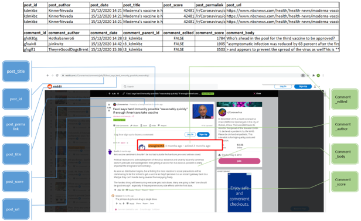
<p class="caption">(\#fig:unnamed-chunk-2)Snapshot of the tabular dataset, and a Reddit post with illustrated elements</p>
</div>


## 2.	Methodology

The overall methodology is as illustrated in Figure 2. First, the corpus consisted of Reddit comments was obtained (see Section 1.1). This was followed by text pre-processing such as tokenisation, setting text to lower case, stop-word removal, retaining only English words, removing emoticons & numbers (See below). We then split the methodology into two parallel but distinct tasks: topic modelling and sentiment analysis. An in-depth analysis of the model types and features can be found in Section 3. 

<div class="figure" style="text-align: left">
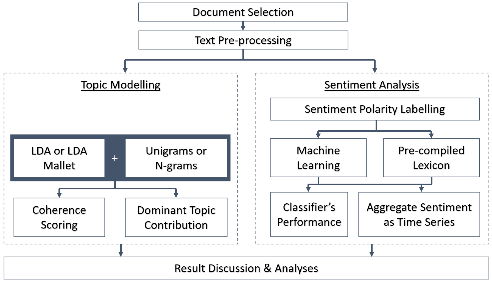
<p class="caption">(\#fig:unnamed-chunk-3)Overall methodology</p>
</div>

### 2.1.	Topic Modelling

Topic Modeling results are mixed when message length is short (Hong & Davison, 2010). We wanted to measure if an ad-hoc heuristic during pre-processing (Tang J et al., 2014) would improve the interpretability of results. We have attempted to aggregate threaded comments from the same contributor.  

We have relied on Gensim’s implementation of the LDA model, and a baseline parameter required is to pre-define the number of topics. In order to arrive at a baseline, we performed iterations of the number of topics using Gensim’s coherence scoring to arrive at an optimum based on qualitative judgement.   

In order to understand and identify key themes within the corpus, we employed the following methodology. First, pre-processing included tokenisation and stop-word removal. The stop-word list was an aggregation relying on NLTK English stop-word corpus and a custom list of manually identified stop-words including single alphabets. Next, we iteratively identified topics by testing n-gram features in the document corpus, setting an optimum topic number, followed by reading the output of LDA and LDA Mallet models. In order to assess the interpretability of the topics, we visualised the dominant topic contributions for each topic.  

### 2.2.	Sentiment Analysis

While sentiment polarity is well known, there are other possible sub-problems such as the classification of subjective and objective texts, identification of the opinion holder, the opinion target, feature or aspects, as well as strength of opinion (Yue et al., 2019). We have focused on sentiment polarity classification as a proxy for attitudes towards COVID vaccines. 

There are several challenges associated with sentiment polarity analysis. The first challenge encountered involves the structure of the dataset itself. In using a supervised learning approach for sentiment polarity classification, labels would be required for every Reddit comment, which is unavailable for our dataset. The second challenge primarily concerns various nuance properties of the English language: the texts may be subjective or objective, English semantics, as well as peculiarities specific to the English language construction such as negation, sarcasm, or irony. The third challenge involves the accuracy of any classification task itself in terms of granularity: performance of a classifier varies based on document or sentence level. 
A usual approach to counteract the first challenge is to use another feature included within the dataset such as existing ratings to represent the sentiment polarity label, which is unfortunately unavailable. For example, most upvotes/downvotes measures, or Reddit commenter ranking only represent the truthfulness of the statement concerning COVID vaccine, not the efficacy of the vaccine itself or the public attitude. We thus elected to label all Reddit comments with 3 labels in terms of attitude towards the vaccine efficacy: ‘1’ for ‘positive’, ‘0’ for ‘neutral’, and ‘-1’ for ‘negative. While this would be a monumental and time-consuming process – there were a total of 34,768 comments – we believe that the labelling process would be significantly value-adding.

The second challenge is significantly more complex and various methods have been proposed. For instance, there are a plethora of pre-compiled lexicons for very quick sentiment polarity classification, whether existing lexicon-based construction or (semi)automatical construction: General Inquirer, SentiWordNet, or OpinionFinder (Yue et al., 2019). However, they generally do not perform well when applied to domain-specific sentiments (Muhammad et al., 2016). Further, complex English semantics is an additional issue: the requirement of contextual understanding severely handicaps most bag-of-word approach. This is precisely where the labelling effort is needed to overcome this challenge. Since we are subjectively labelling the sentiments surrounding COVID vaccines, and then proceed to train the classifier based on this labeled data, we can establish the ground truth specific to this domain knowledge (COVID vaccines), based on which the classifier’s performance can be assessed. The addition of skip-gram features for word-embedding will also ensure that contextual properties of the text would be considered, not just discrete word frequency. All in all, the ground truth labels would aid in assessing which method of sentiment polarity analysis in this specific domain will work best: bag-of-word TF-IDF approach, word-embedding, or pre-compiled lexicons. 

The third challenge may be problematic if one requires the classification outcome for every single comment in this dataset. However, if we aggregate the proportion of positive or negative sentiment, subset by time or otherwise, changes in these measures may be a sufficiently good proxy for enacting public health efforts, or to be used for other time-series forecasting or predictive modelling task. We thus will make use of the result of the best-performing classifier to assess changing positive or negative sentiments over time. 

## 3. Solution Details

### 3.1.	Topic Modeling

In arriving at a final topic model, we discuss the trade-offs in the setting of model parameters. A discussion of the results and the selection of the final model is discussed in section 5 Results.

__3.1.1.	The influence of different models in generated topics: LDA vs LDAMallet__   

Latent Dirichlet allocation (LDA) is an unsupervised learning method widely used in Topic Modelling. Similar to bag of words, the order of words is not important. The assumption in LDA is that each document can be represented by probability distribution across all latent topics, in which the distribution will share a Dirichlet prior.
LDA has the following advantages:  
a)	The result generated from LDA offers optimum representation of consolidated data, which in returns offers higher level of insight.    
b)	The output is simple and easy for interpretation.   
c)	It is frequently being used as base model in Topic Modelling, which set as a guideline for evaluation of further research methods and models.  

However, these are challenges:  
a)	We have to specify the number of topics, k, which is not possible to know before we run the model.   
b)	The word distribution in any generated topic can defer for a fixed k.   

LDAMallet is an optimised version of LDA by applying collapsed gibbs sampling method from Mallet. Park et al. (2019) reported the faster convergence of multimodal latent topic distributions using partially collapsed gibbs sampler. In practice, LDAMallet is widely recognized with better generated topics output and higher coherence score. We will compare the performance of LDA and LDAMallet models in this study.  

We set a constant seed in both LDA models. We also generated a similar number of topics to simplify comparability.

__3.1.2.	The influence of length of documents in generated topics.__  

We undertook heuristic pre-processing on the length of text to influence the optimum number of topics and the coherence score of said generated topics. As reported by Sbalchiero and Eder (2020), the optimum number of topics is reduced with the increase in the length of text.   

<div class="figure" style="text-align: left">
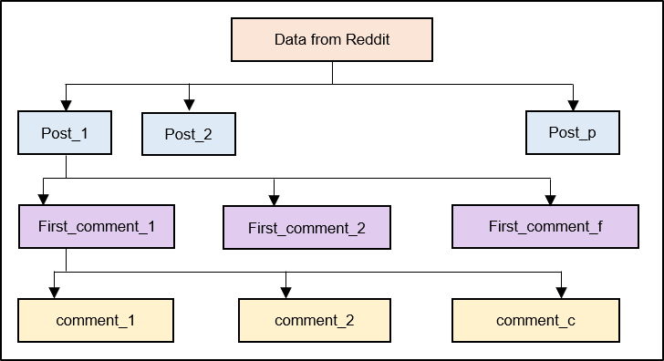
<p class="caption">(\#fig:unnamed-chunk-4)The structure of grouped comments</p>
</div>

Individual comments were grouped under the initial comment (purple box) of each post. In doing so, the length of the resulting document will be longer than any individual comment. Finally, the grouped comments were grouped under each post heading (blue box), which generates even longer documents. In grouping the comments, the population of documents decreased correspondingly.  

We made an assumption that the superset of comments in each post discussed the same topic of interest, thereby increasing the coherence of each output topic.  

__3.1.3.	The influence of words (tokens) in generated topics: Individual words, n-gram and skip-gram__  

N-grams are applied to construct a sequence of n specified words. We created 2-grams, 3-grams and 5-grams, to study how the N-grams would affect the generated topics and coherence scores.  

We observed that with n-gram inputs to the LDA model influenced the interpretability of the generated topics. We also observed that n-gram inputs also influenced the topic word distribution.   

Skip-grams method is a numerical representation of words that is widely used to predict the context word - it learns to predict the context word for a given target word, giving more weight to the context words that are nearby than the more distant ones, please see below for model architecture and example (Mikolov et al., 2013).  

<div class="figure" style="text-align: left">
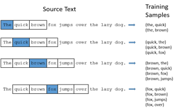
<p class="caption">(\#fig:unnamed-chunk-5)Skip-gram model architecture and example</p>
</div>

However, the draw back to this model is that skip-gram cannot process combined word phases such as “New York” as a single word but identifies two words “New” and “York”.  Given that skip-gram is a supervised model, it is a closed vocabulary model and thus unable to handle out-of-vocabulary (OOV) words, new vocabulary words must be added back to the pre-trained word2vec model and the process must be rerun, which is time consuming (Muller, T. and Schütze, H. (2011).  

### 3.2.	Sentiment Analysis

To overcome the nuance properties of the English language, we have selected 3 types of representation models, namely word2vec (skip-gram), term frequency-inverse document frequency (TF-IDF) and lexical representation.   

__3.2.1.	Skip-gram model__  

As described above, the main advantage of the word2vec skip-gram model is that it is able to retain the semantic meaning of different words within the corpus via similarity value between words.   


<div class="figure" style="text-align: left">
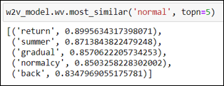
<p class="caption">(\#fig:unnamed-chunk-6)Using Gensim to find the most similar words</p>
</div>


To illustrate this further, we applied the Gensim function “most_similar” to return the closest words relating to ‘normal’. Based on the results shown in Section 6 Table 6, skip-gram model demonstrates that it is able to return words similar to ‘normal’ as they share some context. Additionally, skip-gram is capable of learning from small training data to accurately predict related words (Giatsoglou et al., 2017). Hence, with regards to sentiment analysis, the nuances of the English language can be reduced through the use of skip-gram due to its ability to retain semantic relations.

__3.2.2.	TF-IDF__  

TF-IDF weighs a word in a document and assigns importance of that word based on the frequency of the word within the document through the following formula show in figure x. With this, each post is converted to a row of the TF-IDF matrix and each word is stored in a column vector.

<div class="figure" style="text-align: left">
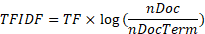
<p class="caption">(\#fig:unnamed-chunk-7)TF-IDF formula</p>
</div>

where TF is the term frequency within the document, nDoc is the number of documents in the corpus and nDocTerm is the number of documents that contains the term.

As such, TF-IDF reflects how important a word is to a single post in the collection of post, which allows us to understand the word with the highest weight as the key characteristic of the post. Through this, we are able to identify the sentiment polarity of the post. 

However, TF-IDF has several limitations. Firstly, given that texts were pre-processed to remove stopwords and irrelevant words, TF-IDF penalises frequent terms that could be key terms, which may lead to the wrong interpretation of the post’s sentiment. Secondly, TF-IDF is not able to process the similarities between words, for example, ‘shot’ and ‘shots’ will be taken as two words although one is the plural form of the other. 

__3.2.3.	Opinion Lexicon__  

The lexicon method operates on a rule-based approach that depends on an external dictionary to determine the semantic orientation (positive, negative or neutral) of the word based the frequency of positive and negative words within the document. For example, if a post has 3 positive words and 5 negative words according to the dictionary, this post will be classified as a negative document. We have used the UIC opinion lexicon, which currently has 6,800 words that were compiled since 2004.

The major limitation of the lexicon is its lack of self-learning capability, the dictionary must be frequently maintained and updated to account for semantic changes in language, of which is a tedious and manual work. Furthermore, sentiment words are often domain specific hence general-purpose lexicon must be customised to improve coverage and sentiment scoring (Muhammad, Wiratunga and Lothian, 2014)

## 4.	Experiments

### 4.1.	Pre-processing 

<div class="figure" style="text-align: left">
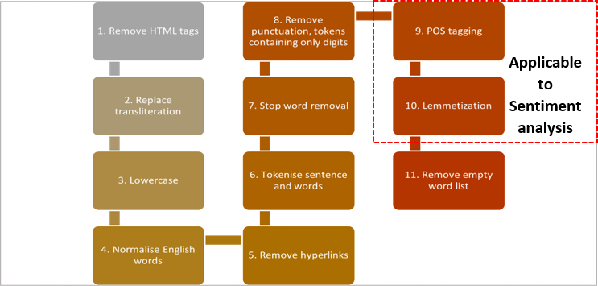
<p class="caption">(\#fig:unnamed-chunk-8)Generalised data pre-processing steps</p>
</div>

The data was pre-processed in similar fashion for both topic modeling and sentiment analysis, except for steps 9-10, which were only applicable to sentiment analysis. Please see below for more details of each step.

|No | Steps	 | Remarks |
|- | ----- | ------- |
|1 |Remove HTML tags	|Used Python library, Beautiful soup to remove HTML tags within comments.|
|2	|Replace transliteration	|Adopted transliteral mapping from ICAO Doc 9303 to replace Unicode transliteral to ASCII alphabets.|
|3	|Lowercase|	Standardized all text content to lowercase characters.|
|4	|Normalize English words|	Replace contractions (e.g., gng, smethng, mssng, I’d, hadn’t) in English to full form |
|5	|Remove hyperlinks|	Remove string patterns that matches URL hyperlink.|
|6	|Tokenize sentence and words	|Break text content into sentences and sentences into list of words.|
|7	|Stop word removal	|Leverage NLTK list of English stop words supplemented with set of stop words (e.g., reddit, subreddit, moderator) identified to not add contextual value. |
|8	|Remove punctuations and numbers	|Removed to reduce noise.|
|9	|POS tagging (sentiment analysis only)	|Marking words to a corresponding part of a speech tag, based on its context and definition to help build lemmatizers.|
|10	|Lemmatization (sentiment analysis only)|	Reduce words to their root form so they can be analyzed as a single item in its dictionary form. This also help in dimension reduction of the vocabulary.|
|11|	Remove empty and auto generated word list	|Remove empty sentence in post processing step. Short sentences maybe reduce to empty list due to previous cleaning steps. Comments that are auto generated by Reddit moderators, marked as deleted or removed or bears no human understandable meaning were also removed|


### 4.2.	Topic Modeling  

**4.2.1	Additional preprocessing**

**a) Aggregating comments to increase document length: Grouping of Text documents**  
Three sets of text corpus were prepared by grouping the comments as explained in section 3.2 Solution details (refer to section ‘Length of documents’).

For individual comments as one document, the original downloaded dataset was used.  Secondly, for individual comments grouped under the first comment in each post, the following codes were applied. The first comments and posts were traced using the ‘comment_parent_id’ and ‘comment_id’. Lastly, the above grouped comments were once again grouped under each post. Please see below for snapshot of python script.

**Python script to group individual comments grouped under the first comment in each post**
```{python.reticulate  = FALSE, eval = FALSE}
def group_subtopic_df(filename):
    id_list = []
    for post_id in filename["post_id"].unique():
        comment_id_list = []
        for comment_id in filename[filename["comment_parent_id"]=="t3_"+post_id]["comment_id"].unique():
            ori_id_sublist = []
            new_id_sublist = filename[filename["comment_parent_id"].isin(["t1_"+comment_id])]["comment_id"].values.tolist()

            while len(new_id_sublist) > len(ori_id_sublist):
                ori_id_sublist = new_id_sublist
                for sub_id in new_id_sublist:
                    if filename["comment_parent_id"].isin(["t1_"+sub_id]).any():
                        sub_sub_id = filename[filename["comment_parent_id"].isin(["t1_"+sub_id])]["comment_id"].values.tolist()
                        new_id_sublist += sub_sub_id
            id_list.append([post_id, comment_id, new_id_sublist])
            
    content_list = [[filename[filename["post_id"].isin([id_list[i][0]])]["post_title"].values[0],
                     filename[filename["comment_id"].isin([id_list[i][1]])]["comment_body"].values[0]+ \
                     " ".join(filename[filename["comment_id"].isin(id_list[i][2])]["comment_body"].values.tolist())] \
                     for i in range(len(id_list))]
    
    topic_id_df = pd.DataFrame(id_list, columns=["post_id", "comment_id", "sub_comment_id"])
    topic_content_df = pd.DataFrame(content_list, columns=["post_body", "subtopic_comment"])
    full_topic_df = topic_id_df.join(topic_content_df)
    full_topic_df["sub_comment_len"] = full_topic_df["sub_comment_id"].apply(len)
    return full_topic_df
  
  
def group_subtopic_up_df(filename):
    full_post = []
    for post in filename["post_body"].unique():
        post_ = [post] + filename[filename["post_body"].isin([post])]["subtopic_comment"].tolist()
        full_post.append(" ".join(post_))
    return pd.Series(full_post)
```

**b) Preparation of vectors**  

Subsequently, the documents were converted into dictionary first and then into vectors. 
•	corpus_to_docs(vaccine_corpus) : Individual word document
•	corpus_to_ngram_docs(vaccine_corpus, n) : N-grams word document
•	corpus_to_skipgram_docs(vaccine_corpus, n, m) : Skip-grams word document

Please see below for snapshot of python script.

**Preparation of vectors**
```{python.reticulate  = FALSE, eval = FALSE}
def text_corpus(raw_file, corpus_col=None):
    if corpus_col==None:
        text_corpus_ = raw_file.apply(remove_stop_words)
    else:    
        text_corpus_ = raw_file[corpus_col].apply(remove_stop_words)
    return text_corpus_

def corpus_to_docs(vaccine_corpus):
    return [i.split() for i in vaccine_corpus.values.tolist()]

def corpus_to_skipgram_docs(vaccine_corpus, n, m):
    doc = [i.split() for i in vaccine_corpus.values.tolist()]
    return [[":".join(gram) for gram in list(skipgrams(L, n, m))]for L in doc]

def docs_to_dict(vaccine_docs):
    return gensim.corpora.Dictionary(vaccine_docs)

def docs_to_vect(vaccine_docs, vaccine_dict):
    return [vaccine_dict.doc2bow(doc) for doc in vaccine_docs]
```


**4.2.2	Modeling: Iterating to identify the optimum number of topics, k**

To determine the optimum number of topics, k, coherence score was used as the evaluation method. The range of number of topics was selected from 2 to 20 with interval 2, thus, the number of topics selected for each run were 2, 4, 6, 8, 10, 12, 14, 16, 18 and 20. For LDA method, the random_state was set at 100 for consistent comparison across different models. Each run was subjected to 100 iterations and ‘c_v’ chosen for coherence parameter. Lastly, the number of words to be displayed in each topic was set at 15. Then, the output was visualised in a line chart with the coherence score plotted against the number of topics. These steps were repeated for both LDA and LDAMallet methods. Please see below for python script.

**Selection of optimum number of topics, k**
```{python.reticulate  = FALSE, eval = FALSE}
def coherence_k_score(vaccine_vecs, vaccine_dict, vaccine_docs, range_, model_, random_state_ = None, no_iter_=1000, coherence_='c_v', os_path=None): 
    model_list = []
    coherence_values = []
    model_topics = []
    max_coherence_score = 0
    max_score_topics = 0
    for num_topic__ in range_:
        if model_ == "LDAMallet":
            model_here = LDAMallet_model(os_path, vaccine_vecs, vaccine_dict, num_topics_=num_topic__, no_iter_=no_iter_)
        else:
            model_here = LDA_model(vaccine_vecs, vaccine_dict, random_state_, num_topics_=num_topic__, no_iter_=no_iter_)
            
        coherence_model = CoherenceModel(model=model_here, texts=vaccine_docs, dictionary=vaccine_dict, coherence=coherence_)
        model_topics.append(num_topic__)
        model_list.append(model_)
        coherence_values.append(coherence_model.get_coherence())
        print(f"#Topics: {num_topic__}\tScore: {coherence_model.get_coherence():.4f}")
        
        if coherence_model.get_coherence() > max_coherence_score:
            max_coherence_score = coherence_model.get_coherence()
            max_score_topics = num_topic__

    x = range_
    plt.plot(x, coherence_values)
    plt.xlabel("Num Topics")
    plt.ylabel("Coherence score")
    plt.legend(("coherence_values"), loc='best')
    plt.show()
    
    return max_coherence_score, max_score_topics
```


__4.2.3	Modeling: Standardising k topics for interpretation__  

We applied n-gram sequences to the tokens in both LDA methods. To simplify comparability, if the optimum number of topics generated for LDA and LDAMallet was different, then topics were generated in both combinations and labeled. Please refer to below for snapshot of script.

**Interpretation of generated topics**
```{python.reticulate  = FALSE, eval = FALSE}
def LDA_model(vaccine_vecs, vaccine_dict, random_state_=100, num_topics_=10, no_iter_=1000):
    return gensim.models.ldamodel.LdaModel(corpus=vaccine_vecs, id2word=vaccine_dict, iterations=no_iter_, num_topics=num_topics_, random_state=random_state_)

def LDAMallet_model(os_path, vaccine_vecs, vaccine_dict, num_topics_=10, no_iter_=1000):
    os.environ.update({'MALLET_HOME':os_path})
    mallet_path = os_path+'bin/mallet'
    return gensim.models.wrappers.LdaMallet(mallet_path, corpus=vaccine_vecs, iterations=no_iter_, num_topics=num_topics_, id2word=vaccine_dict)

def show_topics(model, num_words_, num_topics_):
    topics_ = model.show_topics(num_topics_, num_words_)
    Topic_df = pd.DataFrame([re.findall(r"[A-Za-z:]+", topics_[i][1]) for i in range(num_topics_)]).T
    Topic_df.columns = ["topic_"+str(n) for n in range(num_topics_)]
    return Topic_df
```


**4.2.4	Visualization: Presentation of topics**  

Lastly, the generated topics will be printed for further topic analysis and labelling. Also, the results will be tagged to the comments with keywords (figure below) to understand how the comment falls into that topic. 

<div class="figure" style="text-align: left">
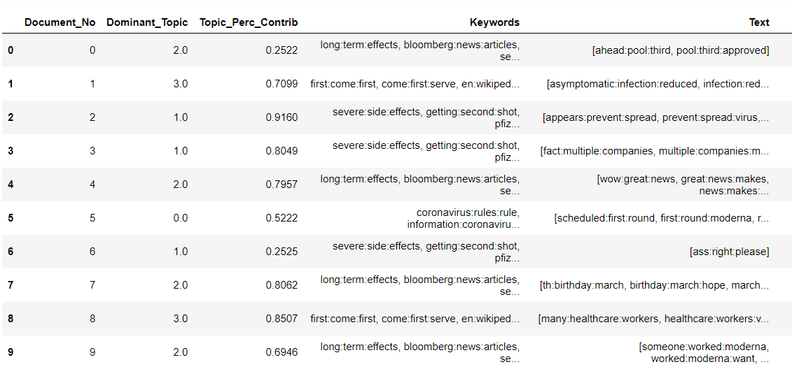
<p class="caption">(\#fig:unnamed-chunk-9)Topics grouped to the comments - LDA</p>
</div>

<div class="figure" style="text-align: left">
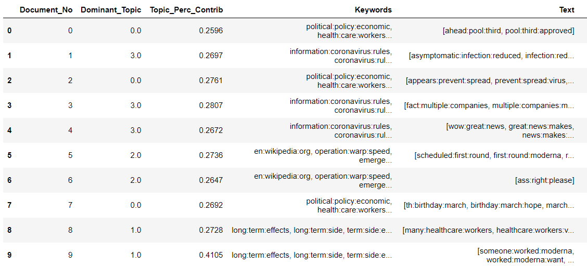
<p class="caption">(\#fig:unnamed-chunk-10)Topics grouped to the comments - LDA Mallet</p>
</div>

LDAVis also being used to understand Intertopic Distance (see below).

<div class="figure" style="text-align: left">
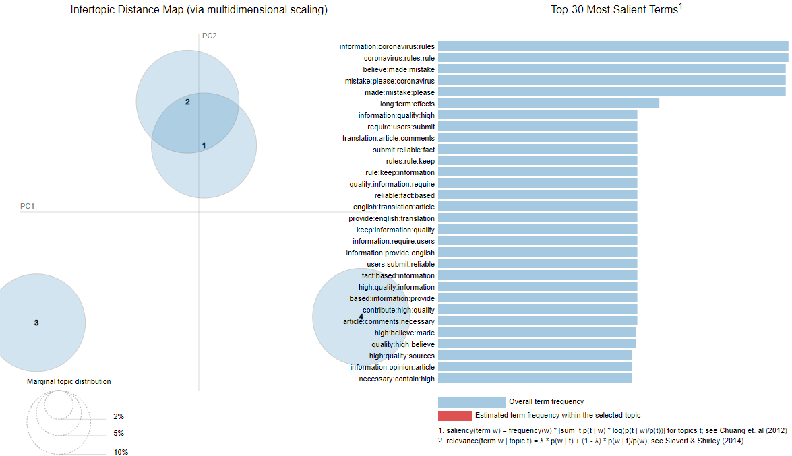
<p class="caption">(\#fig:unnamed-chunk-11-1)Topic Modelling Intertopic Distance Map</p>
</div><div class="figure" style="text-align: left">
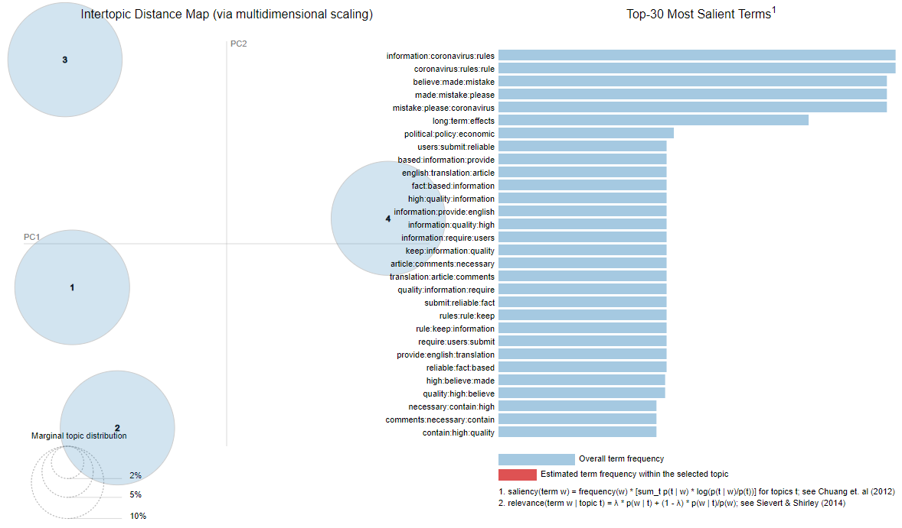
<p class="caption">(\#fig:unnamed-chunk-11-2)Topic Modelling Intertopic Distance Map</p>
</div>

## 4.3.	Sentiment analysis

The source data consists of 34,768 unlabeled records. We had manually labeled 20,228 records (~58%) with –1, 0 and 1 representing negative, neutral, and positive sentiment, respectively. 

The experiments were done using Python programming language using Jupyter notebook with drivers installed for training neural network models. Please see appendix I for hardware and graphics processing unit (GPU).

__4.3.1.	Additional Data Preprocessing__

Next, the labeled data which will be used for training the supervised machine learning (ML) models are separated from the unlabeled data. Please see below for data modeling process. 

<div class="figure" style="text-align: left">
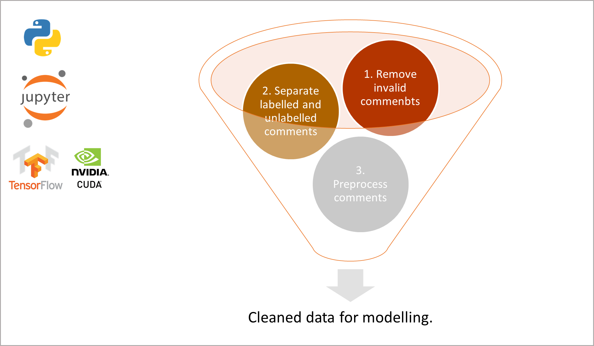
<p class="caption">(\#fig:unnamed-chunk-12)Data modeling process</p>
</div>

__4.3.2.	Partition data__

After applying the data preprocessing steps on the labeled data, 17795 rows were left for data modelling. As we needed to compare the performance of several models, we omitted validation data and adopted a 80-20 partition of training and testing data.

__4.3.3.	Modeling__

This is a multiclass (3 classes) classification task and the below are the list of classifiers identified for modeling.

| Classifier | Parameters |
| ---------- | ---------- |
|RandomForest	| max_depth=20, min_samples_leaf=0.005,min_samples_split=0.005, n_estimators=60, n_jobs=-1 |
|Logistic Regression	| C=0.005, max_iter=500, multi_class='ovr', n_jobs=-1,solver='newton-cg'|
|Decision Tree Bagging	| base_estimator=DecisionTreeClassifier(random_state=169279),bootstrap_features=True, max_features=300, max_samples=0.5,n_estimators=60, n_jobs=-1, oob_score=True |
|XGBClassifier |	base_score=0.5, booster='gbtree', colsample_bylevel=1,colsample_bynode=1, colsample_bytree=0.8, eval_metric='auc',gamma=0, gpu_id=-1, importance_type='gain',interaction_constraints='', learning_rate=0.05, max_delta_step=0,max_depth=5, min_child_weight=1, missing=nan,monotone_constraints='()', n_estimators=1000, n_jobs=-1,num_class=3, num_parallel_tree=1, objective='multi:softprob',random_state=169279, reg_alpha=0, reg_lambda=1,scale_pos_weight=None, seed=169279, subsample=0.8,tree_method='exact', validate_parameters=1, verbosity=None |
|Multinomial Naïve Bayes|	alpha=1.3|
|TensorFlow Dense Neural Network|	4 dense hidden layer, batch_size=64, epochs=50|

.GridSearchCV library was used in determining the above optimal parameters that provided the best results based on training data. The criteria set for the optimization was to maximize the predictions accuracy. The above models were chosen given the varying characteristics such as linearity, type of ensemble learning (I.e., bagging and boosting), tree-based classification and probabilistic classification.

## 5	Results and Analyses

### 5.1	Topic modeling

Based on the methods described above, we obtained the following results plotting the coherence scores with the number of topics


<div class="figure" style="text-align: left">
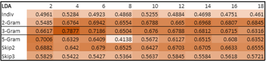
<p class="caption">(\#fig:unnamed-chunk-13)LDA Coherence scoring</p>
</div>
 
<div class="figure" style="text-align: left">
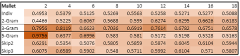
<p class="caption">(\#fig:unnamed-chunk-14)LDAMallet Coherence scoring</p>
</div>

From the above, we can see that the best results for both LDA and LDA Mallet comes from using a 3-gram. Under both models, using 4 topics yields the best overall results. We extract the topics below to understand how the topics are grouped. 

__Topics__
 
<div class="figure" style="text-align: left">
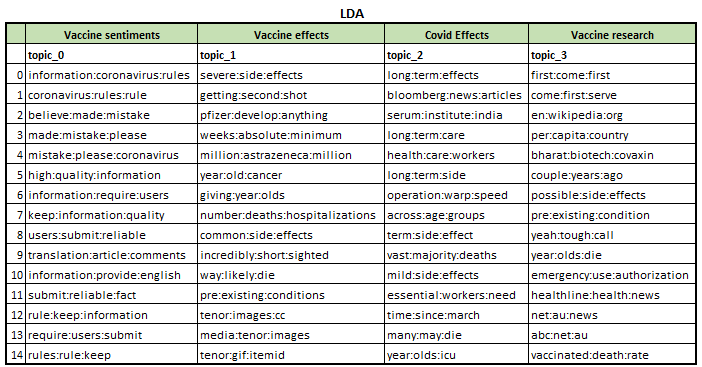
<p class="caption">(\#fig:unnamed-chunk-15)3-gram</p>
</div>

<div class="figure" style="text-align: left">
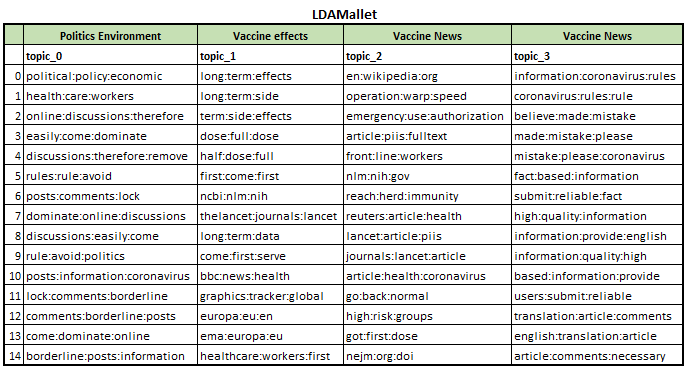
<p class="caption">(\#fig:unnamed-chunk-16)LDAMallet 3-gram topics</p>
</div>

Doing a visual inspection of the results, we see that LDA produced a clearer distinction between the topics, with the 4 topic types being areas of interests for vaccine discussion in an online setting, which is in line with our dataset. We thus decide to go with LDA instead of LDAMallet in our topic modelling segment. 

__Error Analysis and Insights__

During review of the results, we had a difficult time finding a clear-cut distinction between the topics. This may be due to 2 reasons: as the data comes from unstructured forum discussions, removal of stop words may distort key information. The scope of the dataset centres on vaccines, and thus there may not exist many varied topics of discussion within this single theme itself. 

### 5.2	Sentiment analysis

In assessing our model, we looked at 3 metrics:

<div class="figure" style="text-align: left">

<p class="caption">(\#fig:unnamed-chunk-17)Sentiment analysis model scores</p>
</div>

__a)	Accuracy__  
Based on the accuracy performance, the skip-gram + RFC model performed the best with accuracy of 58.2%. We observed that the TF-IDF models have similar accuracy scores as skip-gram models, while the lexicon model performed the worst with 23%.

__b)	Precision - High precision score equates to low false positive rate.__  
Skip-gram +XGBoost performed the best with accuracy of 45.3%

__c)	Recall is the percentage of correctly predicted positive observations in the actual class.__  
Skip-gram +XGBoost performed the best with accuracy of 37.5%.

Given the above assessment, the skip-gram + XGBoost is deemed to be the best performing model on basis that it has the highest precision and recall score, and accuracy only 0.47% less than the top accuracy model of 58.16%. Please see examples of correctly classified outputs in below.

<div class="figure" style="text-align: left">
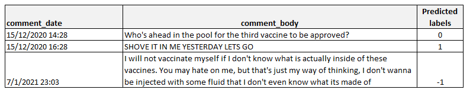
<p class="caption">(\#fig:unnamed-chunk-18)Snapshot of example output for sentiment analysis (correctly predicted)</p>
</div>

__Insights and error analysis__

<div class="figure" style="text-align: left">
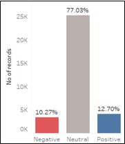
<p class="caption">(\#fig:unnamed-chunk-19)Distrbution of sentiment - Reddit users are largely neutrals</p>
</div>

Based on our distribution of the model results, Reddit users are largely neutral (77%) as most comments consist of users stating facts to counter a minority bias and do not provide any opinion in their comments.

<div class="figure" style="text-align: left">
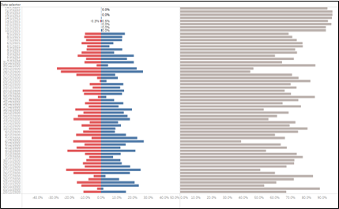
<p class="caption">(\#fig:unnamed-chunk-20)Likert scale time series from oldest (bottom) to newest (top)</p>
</div>

The likert scale show the daily percentage of negative (red), positive (blue) and neutral (grey) from Dec-20 (bottom) to Jan-21 (top). We observed that comments became more neutral over time, with spikes of positive and negative sentiments in between. 

Tableau Dashboard available on [Tableau Public](https://public.tableau.com/profile/suyiinang#!/vizhome/sentiment_analysis_16182051054700/Dashboard1?publish=yes)

Further investigation revealed the complexity of sentiment analysis as the following post shown below should be considered positive but were wrongly labelled. These comments are largely contextual, hence very challenging for models to assign the correctly sentiment.

>	“Scheduled to get my first round of the Moderna on Dec 22!”  -  Neutral  

>	“INTO MY ASS, RIGHT UP IN THERE PLEASE” - Neutral  
 
> “"asymptomatic infection was reduced by 63 percent after the first shot. " – HUGE” - Negative   

Additionally, the nature of Reddit’s comments, such as short character length, images and emojis, makes it difficult for text mining, particularly sentiment analysis.

Lastly, the fact that our dataset was manually labelled gives way of the possibility of human error when classifying comments into ‘positive’, ‘negative’ and ‘neutral’, which in turn will result in less favourable outcomes. 

## 6.	Discussions and Gap Analysis

During the course of the project, we were faced with limitations from both the dataset, as well as the appropriate tools to analyze our particular type of data.  

Our dataset comes from Reddit, which were unlabeled. This made them only suitable for unsupervised learning methods, and to run supervised models on our data, we had to manually label them. This proved to be too time consuming a task for our team, being able to label in total 16 thousand rows, or roughly only 40% of the entire dataset. Had we been able to have the time and resources to label them all accurately, we may be able to obtain better sentiment analysis results.

In addition, our pre-processing methods were for generalized text documents that contains proper semantics and grammatical structures, which was not the case for our dataset. Removing common stop words often distorted the meanings and sentiments of some of the comments, and if given more time and resources, we may have been able to come up with a more specialized stop words rule to produce better results. We also chose to remove hyperlinks, which further reduced the context of some of the comments, and this was discovered only in hindsight as the general rule when it comes to text processing is to removal hyperlinks as part of the text pre-processing. 

Lastly, the text data came with many usages of emoticons, which we removed as we did not have a proper method to process them. Emoticons could serve as indicators for sentiment analysis, and if there exist established libraries to process these emoticons, we may obtain a better result from our models as well. 

## 7. Future Work and Conclusion

Unstructured data generated from social media, in a global pandemic, provides strong government and public health justification to explore COVID-19 vaccine hesitancy via topic modelling and sentiment analysis. Topic modelling revealed clear delineation of specific discussions, even when the overall dataset was already restricted to COVID-19 vaccine news. Sentiment analysis opened up the feasibility for sentiment polarity classification model to gauge public attitudes, and insights into when specific sentiments spiked over time. 

There are several potential avenues for improvements. Using a larger dataset that spans over a year or more and has geographical location of these users would provide more useful insights to the user. Given that our topic is quite specific, the combination of domain specific lexicon coupled with a machine learning model for higher classification could be explored. Kherwa and Bansal (2018) applied semantic N-gram in topic modelling and concluded that the performance of the model generally improved. Future research could be done to advance such a hypothesis. More advanced embeddings such as emoji2Vec that learns emoji representation from the description. The combination of emoji2Vec and word2Vec for more context and meaning of the post could be explored. On the whole, our textual analysis results were promising in identifying area of focus, and gauging public sentiments for vaccinations.  

## 8. Reference

Giatsoglou, M., Vozalis, M. G., Diamantaras, K., Vakali, A., Sarigiannidis, G., &Chatzisavvas, K. C. (2017). Sentiment analysis leveraging emotions and word embeddings. Expert Systems with Applications, 69, 214-224.

Hong, Liangjie and Davison, Brian D. Empirical study of topic modeling in Twitter (2010). In Proceedings of the First Workshop on Social Media Analytics, SOMA ’10, pp. 80–88, New York, NY, USA, 2010. ACM. ISBN 978-1- 4503-0217-3.

Meagher, D. (2021). Commentary: Vaccinations, not Vaccines alone, will help end the COVID-19 pandemic. Retrieved February 24, 2021, from https://www.channelnewsasia.com/news/commentary/coronavirus-covid-19-vaccine-us-europe-china-politics-who-end-13943748

Mikolov, T., Chen, K., Corrado, G., & Dean, J. (2013). Efficient estimation of word representations in vector space. arXiv preprint arXiv:1301.3781.

Muhammad, A., Wiratunga, N., and Lothian, R. (2014). A Hybrid Sentiment Lexicon for Social Media Mining. 2014 IEEE 26th International Conference on Tools with Artificial Intelligence, Limassol, Cyprus, 2014, pp. 461-468, doi: 10.1109/ICTAI.2014.76.

Muhammad, A., Wiratunga, N., & Lothian, R. (2016). Contextual sentiment analysis for social media genres. Knowledge-based systems, 108, 92-101.

Müller, T. and Schütze, H. (2011). Improved modeling of out-of-vocabulary words using morphological classes. In Proceedings of the 49th Annual Meeting of the Association for Computational Linguistics: Human Language Technologies: short papers - Volume 2 (HLT '11). Association for Computational Linguistics, USA, 524–528.

Peretti-Watel P, Patrick P-W, Ward JK, Schulz WS, Pierre V, Larson HJ (2015). Vaccine Hesitancy: Clarifying a Theoretical Framework for an Ambiguous Notion. PLoSn Curr 2015. http://dx.doi.org/10.1371/currents.outbreaks.6844c80ff9f5b273f34c91f71b7fc289 
Reddit. (2020) Reddit’s 2020 Year in Review. Reddit blog. https://redditblog.com/2020/12/08/reddits-2020-year-in-review/

Reddit. (2021). In Wikipedia. Retrieved 21 February 2021, from https://en.wikipedia.org/w/index.php?title=Reddit&oldid=1008718803

Sallam, M. (2021). COVID-19 Vaccine Hesitancy Worldwide: A Concise Systematic Review of Vaccine Acceptance Rates. Vaccines 2021, 9, 160. https://doi.org/10.3390/vaccines9020160

Tang J, Meng Z, Nguyen X, Mei Q, Zhang M (2014). Understanding the Limiting Factors of Topic Modeling via Posterior Contraction Analysis. Proceedings of the 31st International Conference on Machine Learning, Beijing, China, 2014. JMLR: W&CP volume 32 http://proceedings.mlr.press/v32/tang14.pdf 

Yue, L., Chen, W., Li, X., Zuo, W., & Yin, M. (2019). A survey of sentiment analysis in social media. Knowledge and Information Systems, 60(2), 617-663. 


---
Background vector created by rawpixel.com - www.freepik.com
