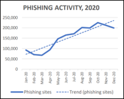
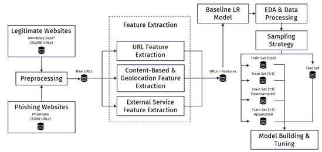
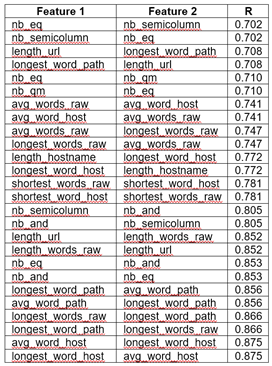
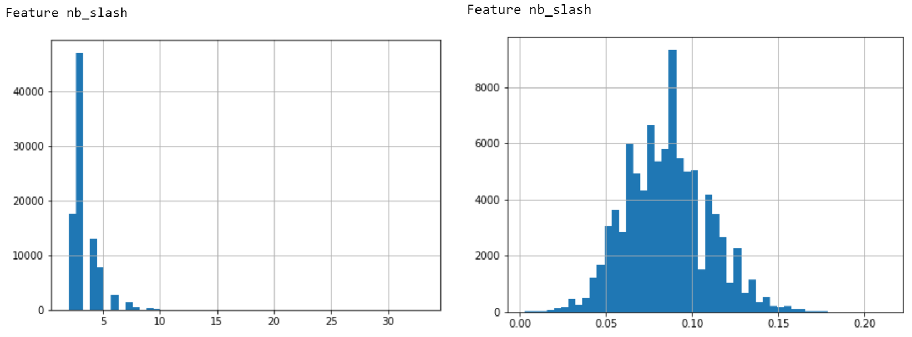
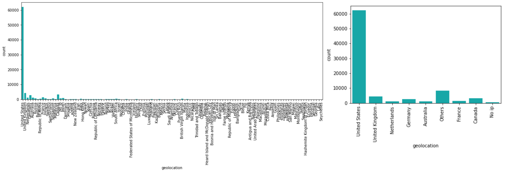
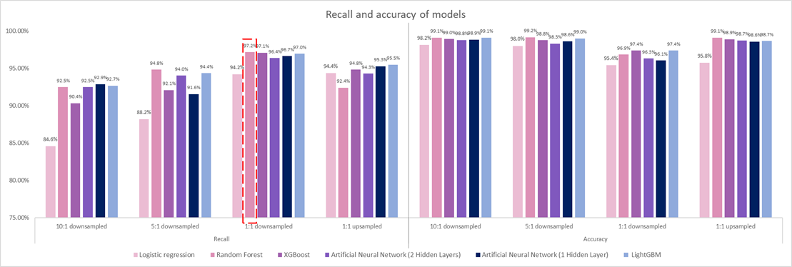
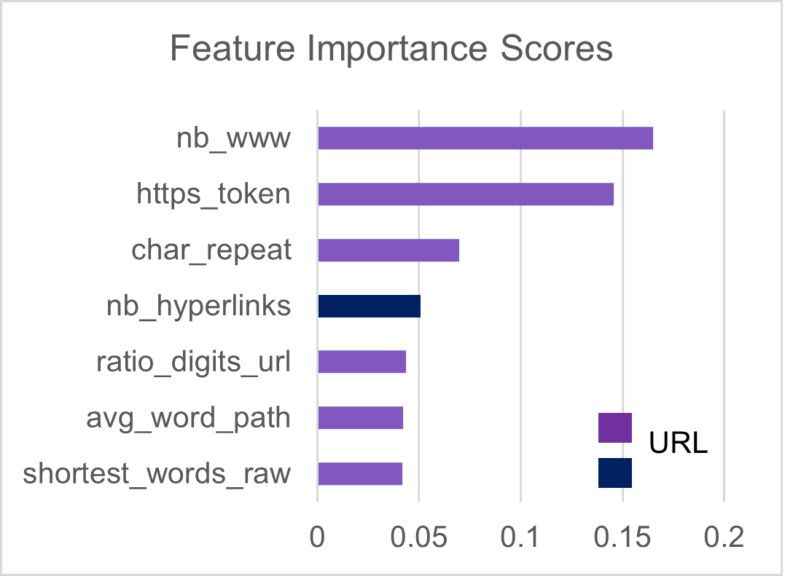
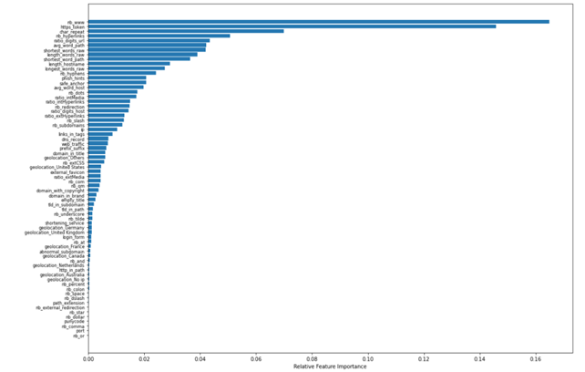

Categories: `machine-learning`, `phishing`

# Catching Phishes with Machine Learning

By Su Yiin Ang, Anne Nyugen Nhi Thai An, Gordy Adiprasetyo, Kendra Luisa Balong Gadong.

*This was written as part of the requirements for the Applied Machine Learning module for [MITB](https://scis.smu.edu.sg/master-it-business).*

---

## 1. Introduction

Phishing websites are websites that are constructed to look identical to the real website with intention to trick recipients into divulging confidential data such as usernames and passwords. In 2020, the number of phishing sites doubled across the year as shown in Figure 1. Additionally, the [FBI reported](https://www.ic3.gov/Media/PDF/AnnualReport/2020_IC3Report.pdf) that phishing attacks in 2020 had resulted in a financial loss of over USD54mil, with such attacks rising exponentially over the past 5 years.

  
Figure 1 Phishing activity trend in 2020. (Source: APWG Phishing Activity Trends Report)

## 2. Project Objective

As internet usage and phishing websites grow, the need for automatic phishing detection is increasingly important to protect users. This project’s objective is to build a machine learning model that can detect phishing websites accurately based on the raw URL. This model can be applied to the backend of internet related applications such as search engines, browser add-ons, and platforms that allows embedding of external sites, which alerts users when a phishing website is being loaded. This would help warn users from accessing the phishing website and thus falling prey to such schemes.  

The primary performance measure for the models is identified to be recall score. From the perspective of a user browsing websites, false negatives are extremely costly as users might enter confidential and crucial financial information without knowing. On the other hand, false positives are not particularly costly as users can override browser’s warning to proceed if they are certain that the website is legitimate. 

  
Figure 2 Project Pipeline of Phishing Detection Machine Learning Model

## 3. Compiling Legitimate & Phishing Websites

URLs for legitimate websites were taken from [Singh (2020)](https://data.mendeley.com/datasets/gdx3pkwp47/2). The original dataset contains about 1.2M URLs labelled as legitimate or phishing. Only a portion of legitimate websites were taken from this list (82,866 legitimate URLs). Phishing URLs from this list are not used as phishing URLs are usually short-lived and this data source was already a year old when this project was done. Phishing URLs are taken from Phishtank instead, a website listing live and confirmed phishing URL. The two lists are combined and basic pre-processing such as removing duplicates was performed.

## 4. Feature Extraction

The features used in this project were adapted from Hannousse & Yahiouche ([link 1](https://data.mendeley.com/datasets/c2gw7fy2j4/3) and [link 2](https://www.sciencedirect.com/science/article/abs/pii/S0952197621001950) here), with some changes and additions. This paper was chosen as modelling using the features in this paper show promising results. 

### 4.1 URL Features

URL features are features that are obtained by analyzing the text of URLs. Basic operations such as counting the number of ‘www’, checking whether ‘https’ instead of ‘http’ was used, and checking for unusual extensions such as ‘.exe’ was performed. A total of 55 URL features were extracted as shown in the table below.

Table 1: URL Features and Descriptions
|	No	|	Feature	|	Description	|
|	 -----------	|	 -----------	|	 -----------	|
|	1	|	length_url	|	full URL length	|
|	2	|	length_hostname	|	hostname length	|
|	3	|	ip	|	IP address	|
|	4	|	nb_dots	|	no. of "."	|
|	5	|	nb_hyphens	|	no. of "-"	|
|	6	|	nb_at	|	no. of "@"	|
|	7	|	nb_qm	|	no. of "?"	|
|	8	|	nb_and	|	no. of "&"	|
|	9	|	nb_or	|	no. of "|"	|
|	10	|	nb_eq	|	no. of "="	|
|	11	|	nb_underscore	|	no. of "_"	|
|	12	|	nb_tilde	|	no. of "~"	|
|	13	|	nb_percent	|	no. of "%"	|
|	14	|	nb_slash	|	no. of "/"	|
|	15	|	nb_star	|	no. of "*"	|
|	16	|	nb_colon	|	no. of ":"	|
|	17	|	nb_comma	|	no. of ","	|
|	18	|	nb_semicolumn	|	no. of ":"	|
|	19	|	nb_dollar	|	no. of "$"	|
|	20	|	nb_space	|	no. of %20" or " "	|
|	21	|	nb_www	|	no. of "www"	|
|	22	|	nb_com	|	no. of ".com"	|
|	23	|	nb_dslash	|	no. of "//"	|
|	24	|	http_in_path	|	no. of "http"	|
|	25	|	https_token	|	use of https	|
|	26	|	ratio_digits_url	|	ratio of digits in full URL	|
|	27	|	ratio_digits_host	|	ratio of digits in hostname	|
|	28	|	punycode	|	presence of a punnycode	|
|	29	|	port	|	port indicator	|
|	30	|	tld_in_path	|	top-level domain in path	|
|	31	|	tld_in_subdomain	|	top-level domain in subdomain	|
|	32	|	abnormal_subdomain	|	URLs matching a pattern of w[w]?[0-9]*	|
|	33	|	nb_subdomains	|	no. of subdomains	|
|	34	|	prefix_suffix	|	presence of "-" in domain names	|
|	35	|	shortening_service	|	use of a shortening service	|
|	36	|	path_extension	|	presence of a path extension	|
|	37	|	nb_redirection	|	number of redirections	|
|	38	|	nb_external_redirection	|	number of external redirections	|
|	39	|	length_words_raw	|	number of words	|
|	40	|	char_repeat	|	repeated characters	|
|	41	|	shortest_words_raw	|	shortest words in the url	|
|	42	|	shortest_word_host	|	shortest words in the hostname	|
|	43	|	shortest_word_path	|	shortest words in the path	|
|	44	|	longest_words_raw	|	longest words in the url	|
|	45	|	longest_word_host	|	longest words in the hostname	|
|	46	|	longest_word_path	|	longest words in the path	|
|	47	|	avg_words_raw	|	average words in the url	|
|	48	|	avg_word_host	|	average words in the hostname	|
|	49	|	avg_word_path	|	average words in the path	|
|	50	|	phish_hints	|	"total occurrence of the ff phish hints: ‘wp’, ‘login’, ‘includes’, ‘admin’, ‘content’, ‘site’, ‘images’, ‘js’, ‘alibaba’, ‘css’, ‘myaccount’, ‘dropbox’, ‘themes’, ‘plugins’, ‘signin’, ‘view’"	|
|	51	|	domain_in_brand	|	presence of brand in domain	|
|	52	|	brand_in_subdomain	|	presence of brand in subdomain	|
|	53	|	brand_in_path	|	presence of brand in path	|
|	54	|	suspicious_tld	|	suspicious top-level domain	|  

### 4.2 Content-Based & Geolocation Features

Content-based features are features that are obtained by loading up the websites and analyzing their HTML contents. This includes checking whether web pages contain login forms, checking the number of pop-up windows, or checking the number of hyperlinks. Using the websites’ IP addresses, Geolocation of hosting server was also extracted. A total of 22 content-based features and 1 geolocation feature were extracted as shown in the table below.

Table 2: Content-Based & Geolocation Features and Descriptions
|	No	|	Feature	|	Description	|
|	 -----------	|	 -----------	|	 -----------	|
|	56	|	nb_hyperlinks	|	no. of hyperlinks	|
|	57	|	ratio_intHyperlinks	|	ratio of internal hyperlinks	|
|	58	|	ratio_extHyperlinks	|	ratio of external hyperlinks	|
|	59	|	ratio_nullHyperlinks	|	ratio of null hyperlinks	|
|	60	|	nb_extCSS	|	no. of external CSS files	|
|	61	|	ratio_intRedirection	|	ratio of internal redirections	|
|	62	|	ratio_extRedirection	|	ratio of external redirections	|
|	63	|	ratio_intErrors	|	ratio of internal hyperlinks connection errors	|
|	64	|	ratio_extErrors	|	ratio of external hyperlinks connection errors	|
|	65	|	login_form	|	presence of ‘‘’’, ‘‘#’’, ‘‘#nothing’’, ‘‘#doesnotexist’’, ‘‘#null’’, ‘‘#void’’, ‘‘#whatever’’, ‘‘#content’’, ‘‘javascript::void(0)’’, ‘‘javascript::void(0);’’, ‘‘javascript::;’’, ‘‘javascript’’	|
|	66	|	external_favicon	|	presence of external favicons	|
|	67	|	links_in_tags	|	ratio of internal links in <Link> tags	|
|	68	|	submit_email	|	presence of form actions containing 'mailto:' or 'mail()'	|
|	69	|	ratio_intMedia	|	ratio of internal media file links	|
|	70	|	ratio_extMedia	|	ratio of external media file links	|
|	71	|	sfh	|	presence of forms with empty string or 'about:blank'	|
|	72	|	iframe	|	presence of < iframe > tag	|
|	73	|	popup_window	|	presence of pop up window with text fields	|
|	74	|	safe_anchor	|	presence of ‘#’, ‘javascript’, or ‘mailto’ tags	|
|	75	|	onmouseover	|	presence of 'onmouseover' attribute to detect disabling right-click	|
|	76	|	right_clic	|	presence of 'event.button==2' to 'onmouseover' attribute to detect disabling right-click	|
|	77	|	empty_title	|	absence of web page title	|
|	78	|	domain_in_title	|	presence of domain of URL as part of web page title	|
|	79	|	domain_with_copyright	|	presence of domain of URLs within copyright logo	|
|	80	|	geolocation	|	country geolocation, based on IP address	|

### 4.3 External Service Features

External Service features are obtained by querying reference third party services and search engines. For instance, we check whether the URLs are indexed by Google. URLs without Google Index might be too short-lived to be indexed by Google and therefore might indicate that they are phishing URLs. A total of 7 such external service features are shown in the table below.

Table 3: External Service Features and Descriptions

|	No	|	Feature	|	Description	|
|	 -----------	|	 -----------	|	 -----------	|
|	81	|	whois_registered_domain	|	whether domain matches WHOIS database	|
|	82	|	domain_registration_length	|	length of domain renewals	|
|	83	|	domain_age	|	age of URL domains	|
|	84	|	web_traffic	|	number of visitors, retrieved from Alexa	|
|	85	|	dns_record	|	whether URL domain is registered within the DNS	|
|	86	|	google_index	|	whether website was indexed by Google	|
|	87	|	page_rank	|	Google Page Rank value, from Openpagerank	|

## 5. Baseline Model
The fully extracted dataset contains 90,576 observations and 89 columns (comprising 3 ID columns, 1 target, and 85 features). Using only the 55 URL features, we built a logistic regression model to be used as baseline comparison before performing further feature engineering and selection. URL features were chosen as they are not dependent on accessibility of the websites and only requires raw URL texts. The recall score of this model is 81.7%. 

## 6. Exploratory Data Analysis

### 6.1 Feature & Observation Removal 

EDA was conducted to check for erroneous data and remove features to reduce compute as well as data collection cost especially for content and external features that require querying. 
This revealed 5,438 observations with all missing content feature data. Since the business case focuses on detecting live phishing websites (websites that are not live would also not be able to phish any data and thus do not pose any harm), these websites that were inaccessible are non-representative. These observations were thus removed from the dataset. 
Visual inspection of histogram, bar charts & correlation matrix were used for univariate and bivariate analysis. Discrete numeric or categorical features were dropped when the feature has a high proportion of missing values (for example, querying the site returned a response code that is not 200, or empty content), the feature’s positive label has very low frequency, or the feature has only one single label. These include ‘ratio_nullHyperlinks', 'ratio_intRedirection', 'ratio_intErrors', 'submit_email', 'sfh', 'iframe', 'popup_window', 'onmouseover', 'right_clic', 'brand_in_subdomain', 'brand_in_path', 'suspecious_tld', 'statistical_report', 'whois_registered_domain', 'domain_registration_length', 'google_index', 'page_rank', and 'domain_age'.

  
Figure 3 Example features of ‘ratio_nullHyperlinks' showing only single value for label, and 'brand_in_subdomain’ showing very low frequency positive label

Numeric features were checked for multi-collinearity. Where pair-wise correlation exceeds 0.7 (Table 4), selected features were dropped to maximize the remaining number of features: 'nb_eq', 'length_url', 'avg_words_raw', 'longest_word_host', 'longest_word_path', 'nb_semicolumn', 'shortest_word_host'. 

Table 4: Pair-wise correlation of top correlated features

### 6.2 Processing

The EDA below also showed that most numeric features are extremely skewed, thus requiring standardization. StandardScaler was thus fitted on the train dataset to preserve the numeric features’ mean and standard deviation values for subsequent standardization on the test dataset. Among categorical features, ‘geolocation’ was also heavily skewed and thus re-binned to 9 distinct labels. 
Lastly, categorical features were one-hot encoded as required for model building. As a result, the processed data obtained has 85,138 observations and 68 features in total (including one-hot encoded columns). 

  
Figure 4: Feature ‘nb_slash’ before (left) and after (right) standardization

  
Figure 5: Feature ‘geolocation’ before (left) and after (right) re-binning

## 7. Train-Test Split & Sampling Strategy

The processed dataset was first split into a train:test split of 80:20 to ensure test comparison across all models would be fair since the same test data from sampling would be used. 

The dataset was imbalanced at a ratio of roughly 10:1 legitimate:phishing observations. As well-elucidated in literature, a more balanced down-sampled dataset would increase recall at the expense of accuracy as well as possible loss of information when more data is discarded. On the other hand, up-sampling may introduce bias and overfitting, preventing the trained model from generalizing well upon deployment. Therefore, to address the imbalance which will implicate the performance of the models, a total of 4 different sampling strategies were conducted on the train dataset:
-	Original train set at 10:1 ratio
-	Down-sampled train set at 5:1 ratio
-	Down-sampled train set at 1:1 ratio
-	Up-sampled train set at 1:1 ratio

It is noted that different sampling strategies were done on the train dataset only, and model comparison based on performance measures was conducted on the original imbalanced test dataset.  

## 8. Model Building 

Using the 4 train datasets explained in the previous section, 5 different models were built: 1 logistic regression model, 3 ensemble models (Random Forest, XGBoost and LightGBM), and 2 Artificial Neural Networks (consisting of 1 or 2 hidden layers). These models were chosen in the order of decreasing explainability to trade off with improving performance. 

While specific details differ for each model building process, all models were trained and evaluated with cross-validation on the 4 different train datasets for hyperparameter tuning. Hyperparameter tuning for all models except for neural network models was conducted with a combination of RandomizedSearchCV and/or GridSearchCV for a few rounds, progressively restricting the hyper-parameter values for improved performance. For neural network, [Hyperband](https://www.jmlr.org/papers/volume18/16-558/16-558.pdf) algorithm was used for hyperparameter tuning.

## 9. Model Evaluation and Selection

The main performance measure is recall score, with accuracy used as a secondary measure for an overall sanity check, for the test dataset. 

  
 Figure 6: Test performance across all models and sampling strategies

In general, the models’ performance agrees with existing literature where down-sampling to make training data more balance improves recall and lowers accuracy. With 1:1 up-sampling, recall score drops significantly compared to the 1:1 down-sampling models, with some slight accuracy gained. However, across all models at all different sampling strategies, accuracy does not vary much and stays well above 95%.

Looking at individual models, logistic regression is observed to significantly underperform against all other more complex machine learning models. Logistic regression is therefore not recommended, even with the benefit of more explainability since the financial consequence of wrongful prediction can be quite severe. On the other hand, the Artificial Neural Network, whether with 1 or 2 hidden layers, does not perform consistently better than the ensemble models either, possibly due to the small dataset size at less than 100,000 observations. The ensemble models stack up very well, with the Random Forest model trained on the 1:1 down-sampled dataset scoring the highest recall at 97.2%. This model also has an accuracy of 96.9%. 

We also note that feature collection, engineering as well as model tuning greatly improved the results of our model as we saw an improvement of nearly 19% against the baseline model based on recall score from 81.7% to 97.2%. 

## 10. Chosen Machine Learning Model

Selecting the best model from the model evaluation, this project then chooses the Random Forest with a 1:1 Legitimate:Phishing Ratio Down-sampled by maximizing Recall at 97.2%. Further analysis on the features is done by outputting the feature importance scores shown below. From a total of 68 features, the top 7 features are selected based on the original feature importance graph in Appendix 1.

  
 Figure 7: Test performance across all models and sampling strategies

Classifying them based on the type of features, 6 of the top 7 are under extracted features from the URL: which are (1) the number of ‘www’s (nb_www), where usually legitimate URLs are observed to have only one, (2) the use of an HTTPS (https_token), providing a [secure facility](https://www.smashingmagazine.com/2017/06/guide-switching-http-https/), (3) the number of repeating characters (char_repeat) which is an example of a natural language processing feature, (4) the ratio of digits in full URLs (ratio_digits_url) where a high number would be considered as a phishing indicator, and word-raw features such as (5) the average length of words in a path (avg_word_path), and (6) the shortest words in the URL (shortest_words_raw).

One feature based on the content of the website which was included is the number of hyperlinks (nb_hyperlinks) where legitimate websites are supposed to consist of greater number of pages compared with phishing ones. These top features from the chosen machine learning model are what we should be wary of when clicking on possible phishing websites.

## 11. Summary and Future Work

In summary, machine learning models are effective in detecting phishing websites due to the characteristics of these types of websites. By exploring different machine learning algorithms, from a baseline logistic regression model to a tree-based random forest model, an XGBoost model, a LightGBM model and to a more complex ANN model, it is important to evaluate models based on business use case, which was for this project maximizing recall to detect as many phishing websites as possible. 

This project recommends two possible directions of future work. One is to improve the model by collecting more data on external features or updating certain features that the model has been trained with, e.g. phish_hints feature. Phish hints are collected from confirmed phishing websites from the past that include the strings, 'wp', 'login', 'admin', 'content', 'site', 'images', 'js', 'alibaba', 'css', 'myaccount', 'dropbox', 'themes', 'plugins', 'signin', ‘view’, and that these phishing URLs use the listed sensitive words to gain trust on visited web pages. An improvement of the model is appending the phish hints with an updated list from more phishing websites that will be trained and tested in the future.

After updating and collecting more features, feature selection can be improved by balancing the cost of feature collection versus the recall penalty. The chosen machine learning model in the previous section has revealed that the important features are mostly extracted from the URL, and only one from content, which is a hyperlink-based feature. Hyperlink-based features are found to be much slower than extracting URL-based and external-based features since these require checking every link in the web page. It can be an improvement in model selection to just use URL features without spending a considerable amount of time in extracting all 89 features from the content and external components. Because of lesser time it takes to extract just URL-based features, it is suitable enough for [runtime detection systems](https://www.sciencedirect.com/science/article/abs/pii/S0952197621001950).

Lastly, due to time constraints, this project only explored traditional machine learning algorithms. It is recommended for future work to explore model stacking by combining various machine learning algorithms to further improve the phishing detection model.
Once the model is improved and trained with more recent and relevant data on legitimate and phishing websites, the obtained machine learning model can be deployed through a browser plug-in to catch unwanted phishes.

## 12. Appendix

  
 Appendix 1: Test performance across all models and sampling strategies

---

[Technology vector created by freepik](https://www.freepik.com/vectors/technology')

