# Understanding the willingness of public for Covid-19 vaccination based on survey data.  


*This was written as part of the requirements for the [Visual Analytics module](https://wiki.smu.edu.sg/2021t2isss608/Course_information) for [MITB](https://scis.smu.edu.sg/master-it-business).*

---

## 1. The original visualisation

For this DataViz Makeover, I have used data from [Imperial College London YouGov Covid 19 Behaviour Tracker Data Hub](https://github.com/YouGov-Data/covid-19-tracker), which collects global insights on people's behaviours in response to Covid-19.  

  
*Figure 1*

Before making over the selected visualisation, it is important to have a clear understanding of the [context of the visualisation](https://learning.oreilly.com/library/view/communicating-data-with/9781449372019/ch01.html) and its key takeaways which are dependent on:  
- **Who**: [Public health bodies](https://github.com/YouGov-Data/covid-19-tracker)  
- **What**: To understand the willingness of public for Covid-19 vaccination  
-	**Why**: To show percentage views of positive, negative and neutral along with breakdown of demographic for [public health to drive initiatives / campaigns to encourage vaccinations](https://www.health.gov.au/ministers/the-hon-greg-hunt-mp/media/australias-covid-19-vaccine-information-campaign-begins) for those who are not positive about vaccination.

## 2. Critiques and suggestions for current visualisation
My critique will be based on Ben Jones data visualisation's [four quadrants of clarity and aesthetic](https://dataremixed.com/2012/05/data-visualization-clarity-or-aesthetics/). 

  
*Figure 2*

Ben Jones defined **clarity** as "Does it make sense" and **aesthetics** as "Does it look good".

Based on this concept with the 4 quadrants, I have classified this original visualisation to be in the III quadrant, see below for the explanation on my classification.  

### 2.1 Clarity
|S/N | Critiques           | Improvement points   |
|----|---------------------|----------------------|
| 1 | **Titles are not helpful and has spelling error** - no definition on “Pro-vaccine”. The writer does not explain the concept of pro-vaccine – Are they numbers of  'strongly agrees' only or include 'agree'? | Change title. Rank countries by using percentage of agrees (strongly agree and agree). |
| 2 | **The visualisation on the right is misleading** – by showing only the “strongly agreed %” with no further explanation on selection basis. For example, in terms of 'strongly agreed' to vaccinate, the visualisation ranked France higher than Japan although France has a high number of people who strongly disagree, whilst large proportion of Japanese are 'neutral'. | Remove chart. Use statistical values to showcase survey results. |
| 3 | **Legends not fully labeled** – values from 2-4 are not labeled and may confuse the reader. | Remove numbers and label legends: Strongly Agree, Agree, Neutral, Disagree, Strongly Disagree |
| 4 | **What is the margin of error** - Given that this data is a survey data (a sample size), the survey does not accurately represent the whole populations' opinion due to probability distribution. | Use statistical values and chart (i.e error bars) to show the margin of error for the survey results. | 
| 5 | **No call outs to provide context** - Since this is a static chart, call outs should be used to provide more context | If static chart, include call outs, text or images to enhance the chart. If interactive, include tooltip details and ability to filter. | 
| 6 | **No source data included** | Included source data at bottom of visualisation. |
| 7 | **100% stacked bar chart may not be the most appropriate chart** - As there are 16 countries and 5 opinions, which is alot of variables, it is difficult to gauge agree / disagree / neutral trends using stacked bar chart. | Given that the data is a survey data and that the main idea is to analyse trends for percentage opinions of agrees, disagrees and neutral, the likert (divergent) chart would be more appropriate.  |

### 2.2 Aesthetics
|S/N | Critiques                     | Comments             |
|----|-------------------------------|----------------------|
| 8 | **Colour palette** used is glaring and not meaningful as it does not enhance the conveyance of information. | Use grey for neutral, reddish colours for disagree and bluish colours for agree. Or the "traffic light" colours of Red (Disagree), Yellow (Neutral) and Green(Agree). |
| 9 | **Redundant chart** – The right chart is a subset of the left chart. | If the visualiser wants to highlight the “% strongly agree” field, just tone down the colours of the other fields and use a striking colour for the “% strongly agree” field. Alternatively, a gradual intensity of colour to match the corresponding change in the intensity of the view.|
| 10 | **Location of legends** - there is a lot of whitespace / unused space below the legend | Align legend horizontally below the chart. |
| 11 | **Decimal points of axes are not consistent** - one chart uses no decimal and another uses 1 decimal points. Formatting should be consistent throughout the visualisation. | Use consistent formatting - 1 decimal point. |
| 12 | **Country axis title is not necessary** - Given that Country names are self-explanatory, the axis title can be removed.  | Remove country axis title. |


## 3. Proposed Design
### 3.1 Sketch

  
*Figure 3*  

Notes:  
- Use reddish for disagree, grey for neutral and blueish for agree.  
- Margin of error to be calculated based on proportion rather than mean – want to know the proportion of respondents who are positive / willing to take the vaccine.  
- Make chart interactive – toggle margin of error proportion by positive, negative and neutral; tooltip details, filter on click.  


### 3.2 Advantages of Proposed Design
**1) Margin of error chart**  
Readers will know the quantum of precision to expect for percentage of people agreeable, neutral and disagreeable to the vaccine.  

**2) Ranks countries using agreed opinions**   
By using this method, all agreed opinions are taken into consideration when ranking countries, as opposed to using 1 opinion (strongly agree) as done in the original visualisation. Since there are only two outcomes in reality - vaccinate or do not vaccinate - public health would have an indication on the percentage of population who would opt to vaccinate.    

**3) Neutrals by the side**  
Given that a large proportion of respondents voted neutral, we can observe the trend better with neutrals by the side rather than the usual divergent chart, of which neutrals tend to be between positive and negative.

**4) Interactive charts**    
Readers can toggle survey question, see demographic snapshots by country and see breakdown of opinions by demographic. 

**5) Labeled opinion legend**  
Legends are labeled with proper text instead of numbers, making it immediately clear to the reader.  

**6) Meaningful colour palette**  
Colours are consistent throughout both dashboards, colours are visually pleasing.  


## 4. Final visualisation
### 4.1 Dashboard
For the purpose of this exercise, I have included additional survey questions and demographic data compared to the original visualisation.  

The dashboards are interactive - demographic and country data changes according to selection.

<div class='tableauPlaceholder' id='viz1613681511134' style='position: relative'><noscript><a href='https:&#47;&#47;suyiinang.netlify.app&#47;posts&#47;dataviz_makeover&#47;02_makeover&#47;'></a></noscript><object class='tableauViz'  style='display:none;'><param name='host_url' value='https%3A%2F%2Fpublic.tableau.com%2F' /> <param name='embed_code_version' value='3' /> <param name='site_root' value='' /><param name='name' value='Dataviz2_16136813714570&#47;Dashboard' /><param name='tabs' value='no' /><param name='toolbar' value='yes' /><param name='static_image' value='https:&#47;&#47;public.tableau.com&#47;static&#47;images&#47;Da&#47;Dataviz2_16136813714570&#47;Dashboard&#47;1.png' /> <param name='animate_transition' value='yes' /><param name='display_static_image' value='yes' /><param name='display_spinner' value='yes' /><param name='display_overlay' value='yes' /><param name='display_count' value='yes' /><param name='language' value='en' /><param name='filter' value='publish=yes' /></object></div>                <script type='text/javascript'>                    var divElement = document.getElementById('viz1613681511134');                    var vizElement = divElement.getElementsByTagName('object')[0];                    if ( divElement.offsetWidth > 800 ) { vizElement.style.width='100%';vizElement.style.height=(divElement.offsetWidth*0.75)+'px';} else if ( divElement.offsetWidth > 500 ) { vizElement.style.width='100%';vizElement.style.height=(divElement.offsetWidth*0.75)+'px';} else { vizElement.style.width='100%';vizElement.style.height='2977px';}                     var scriptElement = document.createElement('script');                    scriptElement.src = 'https://public.tableau.com/javascripts/api/viz_v1.js';                    vizElement.parentNode.insertBefore(scriptElement, vizElement);                </script>

Due to limitation of webpage width, visualisation may appear compressed. Hence to enjoy the full experience of this visualisation, please view in Full Screen mode.
This visualisation is also available on [Tableau Public](https://public.tableau.com/profile/suyiinang#!/vizhome/Dataviz2_16136788814200/Dashboard?publish=yes).

### 4.2 Main observations
**1) The French are not at all positive about the Covid-19 vaccine**  
  
*Figure 4*  
Although France has the [7th highest death toll globally as of Feb-2021](https://www.channelnewsasia.com/news/world/france-reports-21-231-new-covid-19-cases-over-24-hours-14191674), the French are not very positive to be vaccinated against Covid-19 with 52% of the respondents being negative about having the Covid-19 vaccination.  
Those who are particularly negative about the vaccine are in the 30 to 39 age band. French women also tend to be more negative than men.  

**2) Females are less positive about the vaccine**
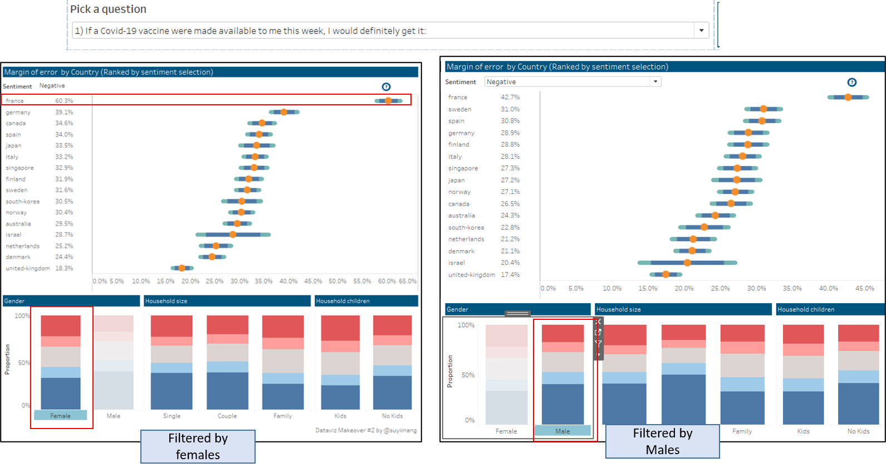  
*Figure 5*  
Females are less positive about taking the vaccine should it be available within the week - on a global level only 45% of females are positive about taking the vaccine as compared to 52% of males.
Furthermore, the margin of error for females is narrower than that of males - indicating higher confidence levels in the produced result.  
The French females are particularly hesitant with 60.3% of the respondents voted against taking the vaccine.   
These vaccine hesitancy by women may be linked to [pregnancy as Covid-19 vaccine trials were not conducted on pregnant women](https://www.theguardian.com/society/2021/jan/31/there-is-a-lot-of-distrust-why-women-in-their-30s-are-hesitant-about-the-covid-vaccine).

**3) Asian Countries - high proportion of neutral response**
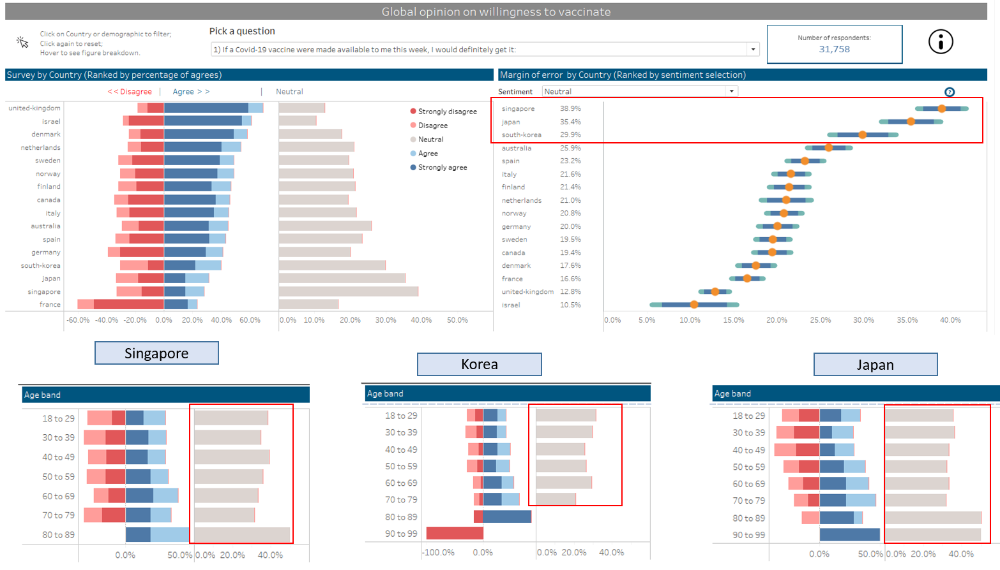  
*Figure 6*  
The only 3 Asian countries (Singapore, Japan and South Korea) in this survey lead the proportion of neutrals with a relatively wide margin of error of 4-5 percentage points.  
Diving deeper into the age bands by respective countries, neutrality appears to be quite consistent across all age bands, except for the older respondents 80 years old and above who are either more receptive or neutral to being vaccinated except for the Koreans 90 - 99 year olds where 100% were negative.  

**4) More than half of the respondents (those in the positive and neutral group) are worried about the potential side effects of Covid-19 vaccine.** 
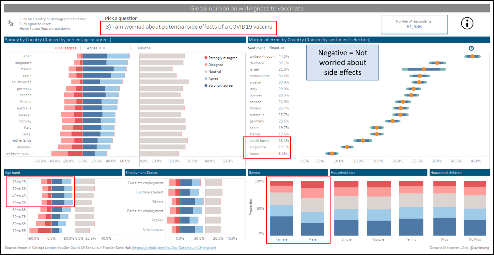  
*Figure 7*  
Although France was the least positive about the Covid-19 vaccine (as see in observation 1), the 3 Asian countries (S.Korea, Singapore and Japan) are the most worried about the side effects of the Covid-19 vaccine.
Further investigation reveals that the younger respondents (those below 59 years old) tend to worry more about the side effects of Covid-19 vaccine compared to older respondents 60 years old and above.
And again we see that females tend to be more worried than males.

**5) Respondents are more positive about taking the vaccine in the future (in a year).**
  
Respondents across all countries are more receptive (those in positive group) to taking the Covid-19 vaccine in a year. Hence it would be interesting to observe how sentiment changes across time.

## 5. Data visualisation steps
Of the 30 files, 14 files were excluded as the “vac_1” field was not available, i.e the vaccine survey was not conducted in these countries. Please see full list of countries included and cleaning methods below:  

|S/N | Country    | Included?  | Pre-Processing in excel | Comments |
|----|------------|------------| ------------------------| -------- |
| 1  | Australia  | Yes        | No                      | n.a      |
| 2  | Canada     | Yes        | No                      | n.a      |
| 3  | Denmark    | Yes        | Yes                     | Employment details split into 7 columns |
| 4  | Finland    | Yes        | Yes                     | Employment details split into 7 columns |
| 5  | France     | Yes        | No                      | n.a      |
| 6  | Germany    | Yes        | No                      | n.a      |
| 7  | Israel     | Yes        | Yes                     | Values on household_size, household_children and employment_status were missing |
| 8  | Italy      | Yes        | No                      | n.a      |
| 9  | Japan      | Yes        | No                      | n.a      |
| 10 | Netherlands| Yes        | No                      | n.a      |
| 11 | Norway     | Yes        | Yes                     | Employment details split into 7 columns |
| 12 | Singapore  | Yes        | No                      | n.a      |
| 13 | south-korea| Yes        | No                      | n.a      |
| 14 | Spain      | Yes        | No                      | n.a      |
| 15 | sweden     | Yes        | Yes                     | Employment details split into 7 columns |
| 16 | united-kingdom| Yes     | No                      | n.a      |


### 5.1 Data Cleaning and Preparation
**Data cleaning with Excel**

**1) Denmark, Finland, Norway, Sweden**  
Employment status were split into 7 columns, see figure below.  
   
*Figure 8*

As such, the following Excel formula was used to combined the 7 columns to get field "employment_status".  
  
*Figure 9*
 
**2) Israel**  
Values for household_size, household_children and employment_status were missing. We have created 3 new columns and included “NA” values for these field.  
  
*Figure 10*

**Extraction with R**  
The following script was used to   
1) extract selected 11 columns - age, gender, household size, household children, employment status, vac 1, vac2_1, vac2_2, vac2_3, vac2_6 and vac_3.  
2) add new column with country name   
3) merge all 16 files into 1  

```
library(dplyr)
library(tidyr)

#extract these columns only
header = c("age","gender", "household_size", "household_children", "employment_status" ,"vac_1", "vac2_1", "vac2_2", "vac2_3","vac2_6", "vac_3") 

#create function to extract selected columns
clean_files <- function(file){
  df <- read.csv(file)
  sub_df <- subset(df, select = header)
  c_df <- cbind(sub_df, country = file)
  clean_df <- c_df %>% filter(c_df$vac_1 != " ")
}

#get list of files
cs_files <- dir("./data") 
my_cs_files <- paste0("./data/",cs_files)

my_cs_data <- NULL
for (file in my_cs_files) {
  temp <- clean_files(file)  
  temp$country <- sub(".csv", "", file) 
  my_cs_data <- rbind(my_cs_data, temp) 
}

#remove ./data/ from country column
my_cs_data <- my_cs_data %>% 
  dplyr::mutate(country = 
                  stringr::str_replace(country, 
                                       pattern = "./data/" , 
                                       replacement = "")) 
                                       
#check number of files - ensure that there are 16 files
my_cs_data %>% 
  dplyr::distinct(country) %>% 
  base::nrow()

write.csv(my_cs_data, file = 'clean/clean_countries.csv') 


```
**Data Cleaning with Excel**  
1) Employment status field  
Upon inspection of the data, I observed that the employment data had a mix of strings and numeric data.  
  
*Figure 11*  
Hence I have replaced the numbers to strings according to the codebook provided by [YouGov](https://github.com/YouGov-Data/covid-19-tracker):  
| Numeric | Changed to           |
| ------- | -------------------- |
| 1       | Full time employment |
| 2       | Part time employment |
| 3       | Full time student |
| 4       | Retired |
| 5       | Unemployed |
| 6       | Not working |
| 7       | Other |

I used the excel Find and Replace function to replace the numeric figures.
  
*Figure 12*  

2) Survey questions: Vac fields (6 total)  
Similarly to 'employment status' above, I have replaced the figures to the following:  
| Original             | Changed to     |
| ---------------------|--------------- |
| 1 - Strongly agree   | Strongly agree |
| 2                    | Agree |
| 3                    | Neutral |
| 4                    | Disagree |
| 5 – Strongly disagree  | Strongly disagree |

I used the excel Find and Replace function for replacement.
  
*Figure 13*  

Save excel file as **clean_countries v2**.

My data is now clean and ready to be loaded into Tableau.

**Data Preparation with Tableau**    
**1) Data Source Tab**  
i) Load file  
On the landing page of Tableau, under Connect > To a File > More. And select the "clean_countries v2" file.  
  
*Figure 14*  

ii) Pivot and rename survey questions.  
Pivot data
  
*Figure 15*  
  
iii) Rename headers to "Questions" and "Opinion"  
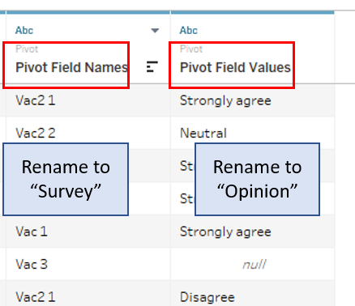  
*Figure 16*  

**2) Employment status**  
Group "NA", "Not working" and "Other" together as "Others"  
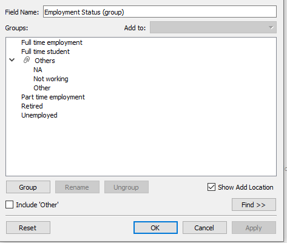  
*Figure 17*   

**3) Age groups**  
Group ages into 8 bands :  
- 18 to 29
- 30 to 39
- 40 to 49
- 50 to 59
- 60 to 69
- 70 to 79
- 80 to 89
- 90 to 99
  
*Figure 18*   

**4) Household children**   
There were some responses that were not in accordance to the codebook. As such, for numeric values that were not within the codebook, I have assumed that the figure indicates number of children.  
Group number of children into 3 bands:  
| Values             | Group to     |
| ---------------------|--------------- |
| Null | NA |
| 1,0 | No Kids |
| 2,3,4,5,6,7, 8 | Kids |

  
*Figure 19*   


**5) Household size**  
Group households into 4 bands:  
| Values             | Group to     |
| ---------------------|--------------- |
| Null | NA |
| 1 | Single |
| 2 | Couple |
| 3,4,5,6,7,8 | Family |

  
*Figure 20*  

**6) Survey**  
Apply the following Aliases  
  
*Figure 21*   

7) Score  
   
*Figure 22*

Apply the following Aliases  
   
*Figure 23*  

### 5.2 Data visualisation steps
#### 1) Likert Scale
1) Create calculated fields  
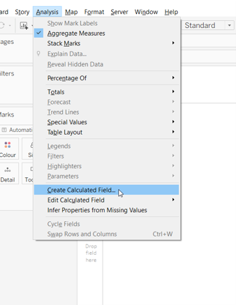   
*Figure 24*     

a) Number of Records
  
*Figure 25*   

b) Count Positive
  
*Figure 26*   

c) Count Negative
  
*Figure 27*   

d) Count Neutral
  
*Figure 28*   

e) Positive Percentage
  
*Figure 29*   

f) Negative Percentage
  
*Figure 30*   

g) Neutral Percentage
  
 *Figure 31*   
 
h) % Neg
  
*Figure 32*   
  
i) % Pos
  
*Figure 33*   
  
j) % Neu
  
*Figure 34*   
  
2) Create chart  
a) Apply filter.  
Drag [Score] and [Survey] to the Filter Panel.  
  
*Figure 35*   
  
For [Score], uncheck "NULL".  
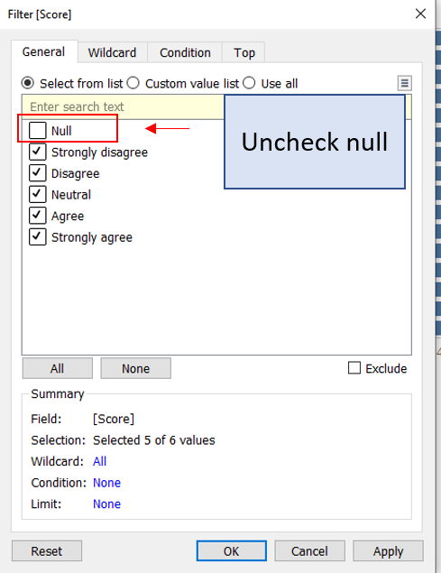  
*Figure 36*   
  
For [Survey], check any survey question.  
  
*Figure 37*   
  
Show [Survey] filter > change to single value (dropdown)
  
*Figure 38*

b) Fill columns and rows.  
Drag [Positive Percentage] and [Negative Percentage] to Columns.  
Drag [Country] to Rows.
Your chart show look like this below:  
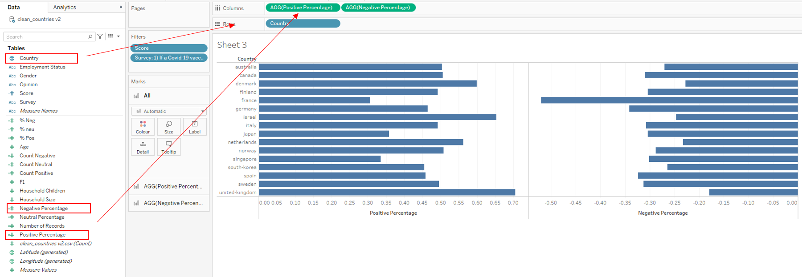  

c) Colour.  
Drag [Score] to Colour.
Your chart show look like this below:  
  
*Figure 39*   

d) Dual and Synchronize axis.  
  
*Figure 40*   
  
e) Change chart type to bar.  
   
*Figure 41*   

f) Remove [Measure Names] from Marks panel.
   
*Figure 42*   

g) Change bar colour.  
  
*Figure 43*   

h) Drag [Neutral Percentage] to Columns
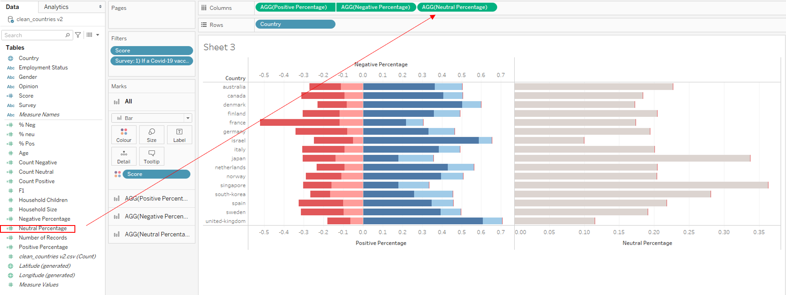  
*Figure 44*   

3) Formatting  
a) Sort score within chart - I want to have the strong opinions to start at the 0 line.  
  
*Figure 45*   

b) Format x-axis.
Hide "Negative Percentage" header.
  
*Figure 46*   

For [Positive Percentage] axis, fixed axis and remove title.
  
*Figure 47*   

For [Neutral Percentage] axis, fixed axis, remove title and adjust tick marks. I fixed the axis so that the bars are proportionately comparable to the positive/negative chart.
  
*Figure 48*   

For both [Positive Percentage] and [Neutral Percentage] - change axis format to percentage with 1 decimal point.
  
*Figure 49*   

c) Remove gridlines
  
*Figure 50*   
  
d) Sort Country
  
*Figure 51*   
  
e) Hide "Country" title since it is obvious.
  
*Figure 52*   
  
f) Change title to "Likert Scale"
 

#### 2) Margin of error Chart
We want to calculate the margin of error by sentiment proportion (positive / negative / neutral).

1) Create parameter - Sentiment  
  
*Figure 53*    
Right click on created sentiment parameter and show parameter. Parameter should appear on the right of the chart.

2) Create calculated fields   

a) Create Sentiment  
  
*Figure 54*    
  
b) Create z scores for 95% and 99% confidence interval  
  
*Figure 55*    

c) Prop_SE
  
*Figure 56*  

d) Prop_ME 95% and 99%
  
*Figure 57*  

e) Lower and upper 95%
  
*Figure 58*  

f) Lower and upper 99%
  
*Figure 59*  

3) Apply filter
Repeat step 2(a) of Likert scale chart above.  

4) Create chart  
a) Drag [Measure Values] to Columns and keep Upper and Lower 99% and 95%. Drag [Country] to Rows.  
  
*Figure 60*  

b) Change chart type to "Line". Drag [Measure Names] to Mark > Path and to Colour. Increase size of chart.  
  
*Figure 61*  

c) Format colour so that the 99%s are one colour and the 95%s are another colour. Arrange the 99%s on top of the 95%s.
  
*Figure 62*  

d) Add in sentiment to Columns. 
  
*Figure 63*  

Change chart type to "Circle" and increase size.
  
*Figure 64*  

Format colour of Sentiment. And dual and synchronize axis as done for the likert chart previously.  

4) Format chart  
a) Remove Sentiment header and Country header. 
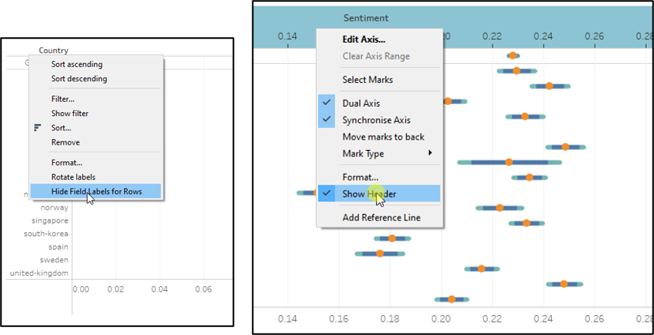  
*Figure 65*  

b) Change x-axis title to "Percentage" and format scale to percentage at 1 decimal point.

c) Remove gridlines as done for Likert chart above. 

d) Sort country by sentiment.
  
*Figure 66*  

e) Change chart title to "Error of Margin by Country"
  
*Figure 68*  

5) Drag [Sentiment] (discrete) into rows.  
  
*Figure 69*  

6) Edit tooltip  
a) Under the Measure Values tooltip, replace text with the following:
  
*Figure 70*  

b) Under the Sentiment tooltip, replace text with the following:
  
*Figure 71*  

#### 3) Demographic breakdown 
1) Age group - Likert Chart.  
Duplicate Likert Scale chart. Drag [Age group] and drop it over [Country].
  
*Figure 72*  

Rename tab to "Age" and title to "Survey by Age bands".

2) Employment status - Likert Chart.  
Similar to step 1 above, duplicate Likert Scale chart. Drag [Employment status (group)] and drop it over [Country].
Rename tab to "Employment" and title to "Survey by Employment status".  

3) Gender - 100% stacked bar chart.  
Drag [Gender] to columns, [Number of records] to Rows and [Score] to Colour.  
  
*Figure 73*   
  
Right click [Number of records] > Quick Table Calculations > Percent of Total.  
Right click [Number of records] > Compute using > Score  
  
*Figure 74*    
  
Hide axis headers.  
  
*Figure 75*  

Remove gridlines.    
  
*Figure 76*  

Edit title to "Survey by gender".  

4) Household size
Duplicate Gender chart. Drag [Household size (group)] and drop it over [Gender].
  
*Figure 77*
  
Rename tab to "HH" and title to "Survey by household size".
Filter out null values from household size.
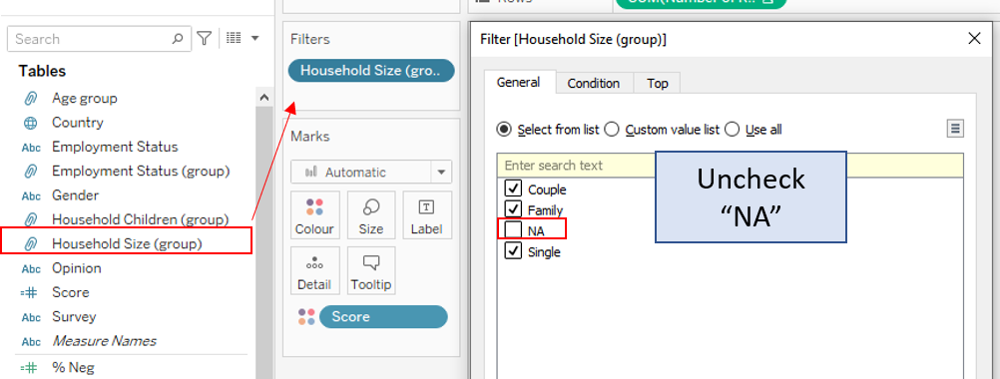  
*Figure 78*  
  
Sort housheold by Single > Couple > Family.
  
*Figure 79*  
  
5) Household children
Repeat step 4, replace [Gender] with [Household Children (group)].
Rename tab to "Kids" and title to "Survey by household children".
Filter out null values from household children.

#### 4) Tooltip for Likert Scale
1) Apply filter on [Score] - Exclude NULL value.

2) Drag [Score] to Columns, [Country], [Number of records] to Rows and [Score] to Colour.
  
*Figure 80*  

3) Right click [Number of records] > Quick Table calculations > Percent of total. 
Right click again > Compute using > Score.
  
*Figure 81*  

4) Format chart.  
a) Increase size to max.
  
*Figure 82*  

b) Remove headers as done previously.
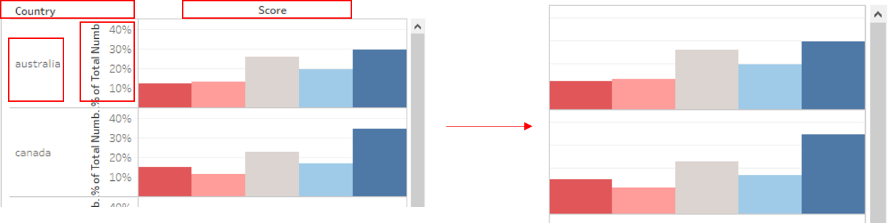  
*Figure 83*  

c) Remove gridlines as done previously.

d) Label chart.  
Drag [Number of records] into Label.   
Right click [Number of records] > Quick Table calculations > Percent of total. 
Right click again > Compute using > Score.  
  
*Figure 84*  

Select Label, change font to size 8, alignment to bottom.
  
*Figure 85*  

Format [Number of records] to percentage using 1 decimal.
  
*Figure 86*  

Rename tab "tooltip for likert"

5) Go to Likert scale tab
Select Tooltip > Insert > sheets > tooltip for likert.
Change maxheight to 200 and filter <All Fields> to <Country>
  
*Figure 87*  

#### 5) Tooltip for Age
As done previously, Duplicate "Tooltip for likert" tab, replace [Country] with [Age group]. Hide headers.  

Repeat for employment, HH, gender and kids, replacing [Age group] with respective fields.

#### 6) Age tab
1) Select Tooltip > Insert > sheets > tooltip for Age.
Change maxheight to 200 and filter <All Fields> to <Age group>
  
*Figure 88*  


Repeat adding Tooltip for employment, HH, gender and kids, replacing <Age group> with respective fields.

#### 7) Error Bar legend
1) Create new calculated field  
  
*Figure 89*  
Ensure data type is "String" and convert to "Dimension"

2) Change chart type to shape and drag [Question mark] into shape.
Click on shape and select a shape.   
For more details on importing shapes, refer to [Tableau blog](https://www.tableau.com/about/blog/2016/2/how-use-custom-shapes-filters-your-dashboard-50200).
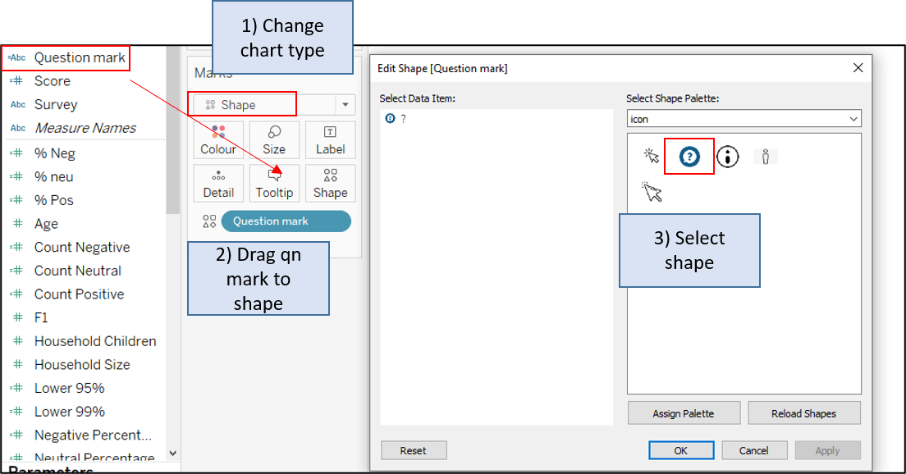  
*Figure 90*  

3) Tooltip.  
Click on tooltip > and update accordingly. Colour palate must be the same as margin of error tab.
  
*Figure 91*  

#### 8) Information legend
1) Create new calculated field  
  
*Figure 92*  

2) Drag [i] into Label, change chart type to shape and drag [i] into shape.
Click on shape and select i shape.

3) Tooltip.  
Click on tooltip > and update accordingly. 
  
*Figure 93*  


#### 9) Score legend
1) Create legend chart
  
*Figure 94*  

2) Drag [Score] to filter. Filter out NULL.

3) Fix axis between 0 and 1.  
  
*Figure 95*  

4) Remove all headers.

5) Shrink to fit. And remove gridlines.  
  
*Figure 96*  

#### 10) Count
1) Drag [Number of records] to Text.
  
*Figure 97*  

2) Click on Text > edit text > change aligned to centre.  
  
*Figure 98*  

3) Format borders.  
  
*Figure 99*  

#### 11) Pointer
1) Create new calculated field  
  
*Figure 100*  

2) Drag [pointer] into Label, change chart type to shape and drag [pointer] into shape.
Click on shape and select pointer shape.
  
*Figure 101*  

3) Tooltip.  
Click on tooltip and remove all text.
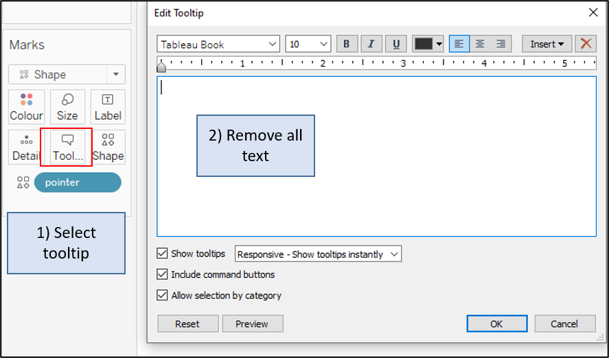  
*Figure 102*  


#### 12) Dashboard
1) Go to Likert Scale tab.
Right click Survey > Apply to Worksheets > All using this data source. Repeat for [Score] filter.
  
*Figure 103*  

2) For all tabs, ensure that the view is in "Entire view".
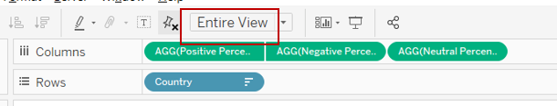  
*Figure 104*  

3) Dashboard Size  
Change size to Automatic.
  
*Figure 105*  

4) Arrange layout according to sketch.  
Drag and drop sheets into frame.
  
*Figure 106*  

5) Hide worksheet titles for all charts.  
  
*Figure 107*  

6) Add titles to charts using dashboard text object.  
  
*Figure 108*  

7) Add banner to Survey by Country by dragging Text to top of chart and edit text.  
  
*Figure 109*  

8) Drag and drop Sentiment parameter just below "Margin of Error" title, realign it and the chart so that countries are aligned for both survey and margin of error chart.
  
*Figure 110*  

9) Similar to step 8, drag the survey question filter to top to the dashboard. Format font size to 14.
  
*Figure 111*  

10) Add in margin of error legend.
  
*Figure 112*  

11) Add in score legend. 
Similar to step 10 above, add in score legend next to the neutral.
  
*Figure 113*  

12) Add dashboard title  
Drag text to top of dashboard and add title: Global Opinion on willingness to vaccinate.  

12) Add Count details.  
  
*Figure 114*  

13) Add in information legend.
  
*Figure 115*  

14) Add in pointer legend
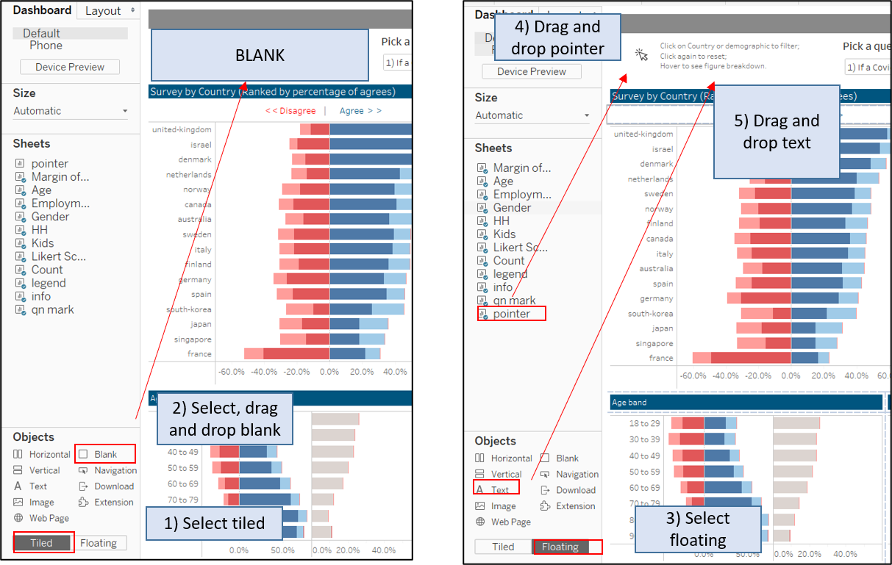  
*Figure 116*  

15) Add action.  
  
*Figure 117*  

16) Add Source
Source: Imperial College London YouGov Covid 19 Behaviour Tracker Data Hub (https://github.com/YouGov-Data/covid-19-tracker)

17) Add author details  
Dataviz Makeover #2 by @suyiinang


---
[Background vector created by freepik](https://www.freepik.com/vectors/background).
