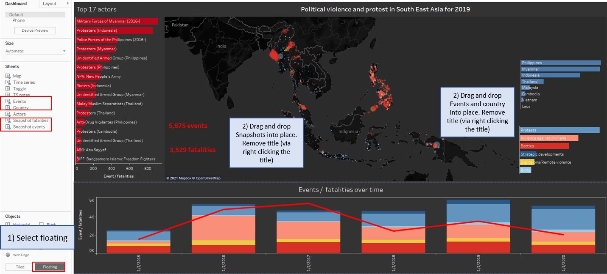

# Political Violence and Protests in South East Asia

*This was written as part of the requirements for the [Visual Analytics module](https://wiki.smu.edu.sg/2021t2isss608/Course_information) for [MITB](https://scis.smu.edu.sg/master-it-business).*

---

For this DataViz Makeover, I have used data from [The Armed Conflict Location & Event Data Project (ACLED)](https://acleddata.com/), a centralized hub for data on all reported instances of political violence and protests around the world.

## 1. The original visualisation

<noscript></noscript><object class='tableauViz'  style='display:none;'><param name='host_url' value='https%3A%2F%2Fpublic.tableau.com%2F' /> <param name='embed_code_version' value='3' /> <param name='site_root' value='' /><param name='name' value='South-eastAsiaArmedConflictAnalysis&#47;South-eastAsiaArmedConflictAnalysis' /><param name='tabs' value='no' /><param name='toolbar' value='yes' /><param name='static_image' value='https:&#47;&#47;public.tableau.com&#47;static&#47;images&#47;So&#47;South-eastAsiaArmedConflictAnalysis&#47;South-eastAsiaArmedConflictAnalysis&#47;1.png' /> <param name='animate_transition' value='yes' /><param name='display_static_image' value='yes' /><param name='display_spinner' value='yes' /><param name='display_overlay' value='yes' /><param name='display_count' value='yes' /><param name='language' value='en' /></object>
                

Before making over the selected visualisation, it is important to have a clear understanding of the [context of the visualisation](https://learning.oreilly.com/library/view/communicating-data-with/9781449372019/ch01.html) and its key takeaways which are dependent on:   

- **Who** (target audience): [Practitioners, researchers, journalists, and governments.](https://acleddata.com/about-acled/)

- **What** (intended meaning): To reveal the spatiotemporal pattern of conflict in selected South-east Asia countries.

- **Why** (desired effect): [To help users (practitioners, policy makers, etc) decide where, how and when to allocate resources](https://acleddata.com/acleddatanew/wp-content/uploads/dlm_uploads/2019/04/ACLED_User-Guide-for-Humanitarians_2019FINAL.pdf)

## 2. Critiques and suggestions for current visualisation
My critique will be based on Ben Jones data visualisation's [four quadrants of clarity and aesthetic](https://dataremixed.com/2012/05/data-visualization-clarity-or-aesthetics/), as well as interactivity of the visualisation.

  

Ben Jones defined **clarity** as "Does it make sense" and **aesthetics** as "Does it look good".

Based on this concept with its 4 quadrants, I have classified this original visualisation to be in the III quadrant as the current visual only tells us the event type location and general trend across the 5 years, with the 2020 data being incomplete and thus misleading.  

### 2.1 Clarity
|S/N | Critiques           | Improvement points   |
|----|---------------------|----------------------|
| 1 | Axes are not consistent – for the “Armed Conflict Event by Type” chart on the right, the axes have their own axis range respectively, some do not even start at 0. This makes it difficult to compare the count by event type. | Merge all the line charts into one chart with the same axis range; event type can be identified by colour. |
| 2 | No source data included.	| Include source data link at the bottom of the visualisation |
| 3 | Title is not reflective of event type – armed conflict does not include non-violent events such as protests, strategic development. | Change “armed conflict” to “Political violence and protest” |
| 4 | Time series chart is misleading – 2020 only consists of 10 months of data from 1 Jan until 31 Oct 2020.  This inconsistency may thus erroneously be reflected as a sharp decline of events in 2020.  | Exclude data from 2020 for annual comparison, otherwise include notes to inform reader that 2020 should not be compared on annual basis, but on a monthly or weekly basis.  |
| 5 | Map should not be the sum of data from 2015 to 2020, as some countries do not have data for certain years (i.e there is no data for Philippines for 2015). As such some countries may appear to have more events due to their availability of data which may mislead readers. | Show conflict map by respective years. Include filter toggle for users to select year. |  

### 2.2 Aesthetics
|S/N | Critiques                     | Comments             |
|----|-------------------------------|----------------------|
| 1 |  Colours used are the default tableau colours and not meaningful. |	Given that it is a rather sombre topic, I suggest using dark theme for the map background and more sombre colour palette, i.e red for violent events, blue for non-violent events |
| 2 | Redundant axis title and labels |	Remove “Event type”, “Event date” and “Count of Sheet1”. |
| 3 | Size of bubble is not indicative of anything. |	Size of the bubble to reflect fatalities of events.|
| 4 | Time series chart colour is not consistent – only in blue. |	Event type colour should be consistent throughout the visualisation. |
 
### 2.3 Interactivity
|S/N | Critiques                     | Comments             |
|----|-------------------------------|----------------------|
| 1 |  Unable to filter map by year – Currently the chart on the left shows the aggregated events across the years. |	Include slider for user to select dates. |
| 2 | Tooltip does not provide details of the event, location, fatalities. | Update tooltip to provide details of the event when hovered over. |
| 3 | Current filter setting only allows users to view one country at a time. (Although this can be changed to multiple selection in tableau public). |	Update filters to allow users to select one or more countries for comparison. |
| 4 | Time series chart (on the right) does not interact with the map. |	Add dashboard actions to allow both maps to interact. |
| 5 | No instructions on how to use interactivity. |	Include instructions on how to use filters and parameters. |

## 3. Proposed Design
### 3.1 Sketch

  

**Notes**
1)	Overlay instructions on interactivity.  
2)	Overlay Country by event type chart per country chart.  
3)	Use red shades for violent events, blue shades for non-violent events.  
4)	Size of map bubbles to reflect number of fatalities.   
5)  Point symbol map - each bubble represent an event.   
6)  Map tooltip to include event location, date, notes and reported fatalities.  

### 3.2 Advantages of Proposed Design

**1) Visual provides good overview of the location, severity and frequency of events**  
At first glance, users are able to have a sense of the frequency (via number of bubbles) and severity (in terms of fatalities) of the events (via size of bubbles) of respective countries.
  
**2) Tooltip provides event details for deeper analysis**    
Users are able to investigate an event further by hovering over a point on the map. Details in tooltip includes event location, date, notes and reported fatalities.  

**3) Interactive time series chart - Event/fatalities over time**   
Users are able to customise viewing according to needs - (i) events type count / fatalities by event, (ii) by date level - week / month / year, (iii) time period to observe and (iv) overlay total fatalities on top of the chart.
From here users are able to identify a specific year/month/week for deeper analysis if needed.

**4) Meaningful colour palatte**  
Red shades represent violent events, while blue shades are non-violent events. Colours are consistent throughout the dashboards. 
  
**5) Map - year filter**  
Shows events by selected year. Users are able to select a specific year for analysis.  

**6) Instructions on how to use the interactive visual**  
With this instructions, users are able to solely focus on analysing conflict.

**7) Main groups involved**   
Users are able to identify the main groups involved in the conflict. 

**8) Country and event type filters**  
User are able to view selected country(ies) and event type(s) on the map for comparison.
 

## 4. Final visualisation
### 4.1 Dashboard

Due to limitation of webpage width, visualisation may appear compressed. Hence to enjoy the full experience of this visualisation, please view in **Full Screen mode** (bottom right of the visualisation). This visualisation is also available on [Tableau Public](https://public.tableau.com/views/DataViz_Makeover03/Dashboard?:language=en&:display_count=y&publish=yes&:origin=viz_share_link).

<noscript></noscript><object class='tableauViz'  style='display:none;'><param name='host_url' value='https%3A%2F%2Fpublic.tableau.com%2F' /> <param name='embed_code_version' value='3' /> <param name='site_root' value='' /><param name='name' value='DataViz_Makeover03&#47;Dashboard' /><param name='tabs' value='no' /><param name='toolbar' value='yes' /><param name='static_image' value='https:&#47;&#47;public.tableau.com&#47;static&#47;images&#47;Da&#47;DataViz_Makeover03&#47;Dashboard&#47;1.png' /> <param name='animate_transition' value='yes' /><param name='display_static_image' value='yes' /><param name='display_spinner' value='yes' /><param name='display_overlay' value='yes' /><param name='display_count' value='yes' /><param name='language' value='en' /></object>
                

### 4.2 Main observations
**1) Overview of political violence and protests in SEA 2019**
 
  

In year 2019, majority of Philippines’ and Myanmar’s events were violent conflicts (Battles, Violence against civilians and explosions).   
Whilst Indonesia experienced a significant number of protests.   
Thailand experienced a fairly even mix of all events.  
The remaining countries – Malaysia, Cambodia, Vietnam and Laos experienced a small number (relative to the region) of protests.  

These violent conflicts tapered since 2018 but with more protest on the rise in recent years.  

*(Data for 2020 is only available until Oct-20, furthermore Covid-19 may have affected number of conflicts, hence I have selected 2019 for observation)*

**2) President Rodrigo Duterte’s war on drugs since July 2016.**

  

Philippines: The significant spike in fatalities due to violence against civilians in July-2016 is attributed to President Duterte’s [‘war on drugs’ after taking office in June 2016](https://www.hrw.org/tag/philippines-war-drugs). This is also prevalent in the top actors involved in these conflicts – anti-drug vigilantes and polices forces of the Philippines. Conflicts happened all over Philippines with majority located on the main island of Luzon (top of Philippines).

**3) Protests and Insurgencies in Thailand**

  
Across the past 10 years, Thailand mainly has two types of conflicts namely Protests by Protesters and "Political Violence by the Malay Muslim Separatists.

  

Thailand’s protests are primarily located in Bangkok and relatively non-violent given the 0 reported fatalities count. However, protests peaked in late 2020 – these [pro-democracy protestors seek royal reforms and the Prime Minister Prayuth Chan-ocha’s resignation]( https://www.dw.com/en/where-is-thailands-protest-movement-heading/a-56363139).

  
A deeper analysis reveals that these conflicts by the [insurgents (Malay Muslim Separatists)](https://thediplomat.com/2018/02/the-slow-burning-insurgency-in-thailands-deep-south/) are located in the southern part of Thailand, near the border of Malaysia. However, since the month of May-2018, during which a significant number of strategic developments occurred, the number of events has tapered down.

**4) The Rohingya Conflict - Myanmar**

  

Myanmar’s conflict is primarily located at the Rakhine state. This conflict is otherwise known as the [Rohingya crisis](https://www.bbc.com/news/world-asia-41566561). These events are generally violent with a high fatality toll. The deadliest month was August 2017, with a reported death toll of 1,043 due to [Myanmar’s military crackdown after a police post was attacked by Rohingya militants](https://www.bbc.com/news/world-asia-41082689). 

**5) Indonesia’s conflicts in 2020 were mainly protests/riots and some battles in West Papua**

  

In the year 2020 (data only available until Oct-2020), despite Covid-19, Indonesia experienced the greatest number of events per country within selected South East Asian countries. Events in 2020 were mainly protests, which spiked significantly in Oct-2020 due to [a contentious new job creation law](https://edition.cnn.com/2020/10/08/asia/jakarta-indonesia-protest-jobs-law-intl/index.html), these protests were generally non-violent with 0 death toll.

Whereas battles in West Papua are a result of an ongoing [West Papua conflict](https://thediplomat.com/2019/09/why-is-west-papua-in-constant-turmoil/). 

## 5. Data visualisation steps
### 5.1 Data Preparation
On the landing page of Tableau, under Connect > To a file > More. And select the data file.
  

### 5.2 Data visualisation steps
#  1) Map
1) Plot map
Drag [Longitude] to Columns and [Latitude] to Rows. 

  

For both fields - right click and change attributes to dimension.

  

2) Drag [Event type] to Marks > Colour, drag [fatalities] to size.

  

3) Format size of bubble and reduce opacity according to preference, here have used opacity of 60%.

  

4) Change colour palette of event type according to figure below. I have used the reddish-orange shades for violent events - battles/violence against civilians/explosions and blue shades for non-violent events - riots/protests/strategic developmet.

  

5) Use dark background for map.

  

6) Filters
i) Add [fatalities] to filter - this allows user to filter events by fatalities range.

ii) Add Country to filter - this allows users to select specific countries

iii) Add Year to filter - map will only display events / fatalities for that year. 
  

7) Add details in tooltip.
  

8) Change title and update formatting.
  
  

9) Change bubble size - so that bubble size doesn't change when filtering by countries as it may skew the sizes to be larger/smaller depending on the total fatalities of the country/select filter.
  

# 2) Time series toggle
1) Create parameters
  

2) Create calculated fields
i) True and False
  

ii) Toggles
  

3) Create toggle button
  

4) Select Shape - you will need two icons to represent yes and no separately. Use parameter toggle to change between yes and no, then assign icons.
  
For more details on importing shapes, refer to [Tableau blog](https://www.tableau.com/about/blog/2016/2/how-use-custom-shapes-filters-your-dashboard-50200).

5) Edit tooltips to include the following:
  

6) Format worksheet - remove background colour, change view to "Entire View".
  

Action for toggling will be added later when creating the time series chart.

#  3) Time series chart
1) Create parameters

i) Date level selector. Value should be in lowercase.
  

ii) Events count or fatalities

  

2) Create calculated fields
i) No of records
  

ii) Date selector
  

iii) Events or fatalities
  

3) Add date range filter - to include data from 2015 to 2020. 

  

4) Drag [date selector] to Columns and [Events or fatalities] to rows.

  

Update the attributes of date selector accordingly.
  

5) Drag [Event type] to colour and change chart type to Bar.
  

6) Rearrange chart by dragging variables to this order.
  

7) Add [Fatalities toggle] to chart.
  

Dual and synchronise axis.
  

Change colour to dark red and increase size.

8) Format chart
i) Remove header of date and axis of fatalities.
  

ii) Remove gridlines, worksheet colour to #333333 and font colour to white.
  

9) Add toggle action
  

10) Add tooltip
i) Create calculated field
  

ii) Drag [Events or fatalities text] to tooltip and edit tooltip accordingly:
  

#  4) Events legend
1) Drag [Event type] to rows and [Event or fatalities] to Columns
  

2) Drag [Event type] twice to colour and label.
  

3) Click on label, change alignment to left, edit text accordingly. Change font colour to white.
  

4) Sort event type
  

5) Format chart.

i) Remove x-axis header
  

ii) Remove gridlines.
  

# 5) Countries legend
1) Drag [Event/Fatalities] to Columns and [Country] to Rows.
  

2) Sort [Country] by [Event/fatalities] in descending order.
  

3) Labels
  

4) Tooltip
  

5) Format
i) Remove a-axis header
  

ii) Remove chart borders
  

iii) Format lines and shadings
  

#  6) Actors
1) Drag [Actor1] to Filters pane. Select fields accordingly to create slider to filter top n actors.
  

2) Drag [Actor1] to rows and [Events or fatalities] to columns.
  

3) Click on label, change alignment to left, edit text accordingly. Change font colour to white.
  

4) Change bar colour to red.
  

5) Sort chart.
  

5) Update title, font to white.
  

6) Remove x-axis header
  

7) Format worksheet - remove gridlines, change worksheet background to grey-black, change font to white
  

# 7) Snapshots - fatalities
1) Drag [Fatalities] to Text.
  

2) Click on text > set alignment to left > change text to the following:
  

# 8) Snapshots - events
1) Drag [No of records] to Text.
  

2) Click on text > set alignment to left > change text to the following:
  

#  9) Notes legend for time series
1) Create calculated field
  

3) Create icon
  

4) Edit tooltip accordingly.
  

5) Format
  

# 10) Country by event type
1) Duplicate 'Country' tab and drag [Event type] to colour
  

2) Remove marks labels
  

3) Arrange event type colour
  

4) Add headers, high field labels for row and change font colour to white
  

#  11) Dashboard
1) Go to "Map" tab.
i) Apply filter to year.
  

ii) Apply filter to fatalities, similar to to [Year] filter use Apply to worksheet > Selected worksheet and apply the filter below.
  

2) For all tabs, ensure that the view is in "Entire View"
  

3) Dashboard size - change size to automatic.
  

4) Arrange layout according to sketch - Drag and drop sheets into frame - map, time series and Actors.
  

5) Add remaining charts
  

6) For the filters, change all the floating.
  

Arrange and format accordingly.
  

7) Select each of the 3 charts (Top n actor, Time series, map) and change dashboard background to #333333
  

8) Change background colour
  

9) Add blank above Top n Actors chart so that title is below map title.
  

11) Used floating > add text.
  

12) Add action
  

13) Add source
  

14) Add author
  

15) Add an instructional overlay.
i) Select floating & vertical -> drop over dashboard.
  

This will pop up (see image below) > expand vertical object to all ends of the dashboard.
  

ii) Select tiled > images > drop over vertical object.
  

iii) Select image and check following boxes. (Hints: My instructions picture was created using powerpoint.)
  

iv) Change background colour to white and opacity to 68%
  

v) Add show/hide button and arrange according to instructions. Change borders and background to white.
  

Test out your overlay instructions.
  

16) Add "< Click here for instructions using Floating & Text", place to the right of instructions button.

17) Add Country by event type overlay
Repeat step 15 above for 'Country by Event' tab.

For step (ii) instead of selecting "images", select the sheet. Place chart over 'Country' chart

For (iv) change background colour to grey and opacity to 100%.

  

---
[Cartoon vector created by vectorjuice](https://www.freepik.com/vectors/cartoon)
 