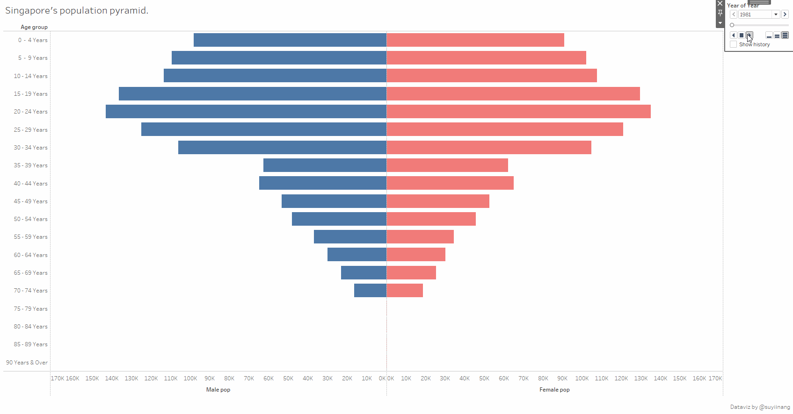
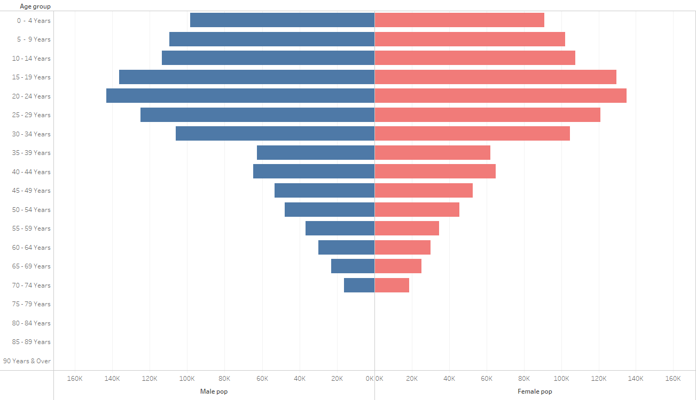

---

*Documenting my Tableau learning journey.*

---

## Population Pyramid

How Singapore's population changes across the years.
    
Full visualisation available on [Tableau Public](https://public.tableau.com/profile/suyiinang#!/vizhome/Singaporespopulationpyramid/Dashboard1).  

## Good for
Analysing population by age and gender.

## How to create - step by step
**The data**  
I have used the Singapore Residents By Age Group, Ethnic Group and Gender from [data.gov.sg](https://data.gov.sg/dataset/resident-population-by-ethnicity-gender-and-age-group?view_id=8ff89d3f-48c8-46e4-8a4d-a8b9f152976f&resource_id=f9dbfc75-a2dc-42af-9f50-425e4107ae84).  

Before loading into Tableau, I have extracted only the female and males data from 1981 to 2019 using Excel as the remaining data is irrelevant for this exercise.  

**Step 1 - Data in correct data type and rename headers**   
I have made the necessary changes to the data types and renamed headers to the following:  
  

**Step 2 - Create calculated field for female and male population**  
In order to create a population pyramid, the female and male population needs to be two separate fields.  
To separate them, I created two calculated fields:
1) Male Population  
  

2) Female Population  
  

**Step 3 - Filter Year**  
Drag "Year" to the Filters Panel and select the year you want.  

**Step 4 - Populate columns and rows**   
Populate rows according to the figure below.  
  

**Step 5 - Reverse the male pop axis**  
Right click the x-axis of male population > Edit Axis > Tick "Reversed" under Scale.  
  

**Step 6 - Format colour**
Under the Marks panel > Female population > colour > select pink.  
  

**Step 7 - Name title**  
  

You now have a static population pyramid chart!  
  

# Now let's add some animation.

**Step 7 - animation**
Remove the "Year" from the Filters panel and drag "Year" to the Pages panel.
  
This slider should show up to the right of your chart:  
  
Click play to view animation.  

# And... there have you it! An animated population pyramid is ready for analysis!  

---
I would like to thank Prof Kam of Singapore Management University for the inspiration.
