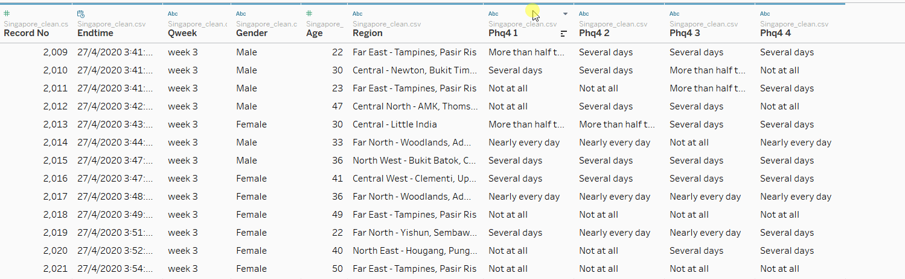
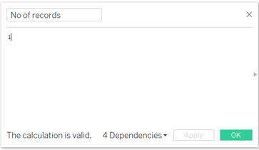
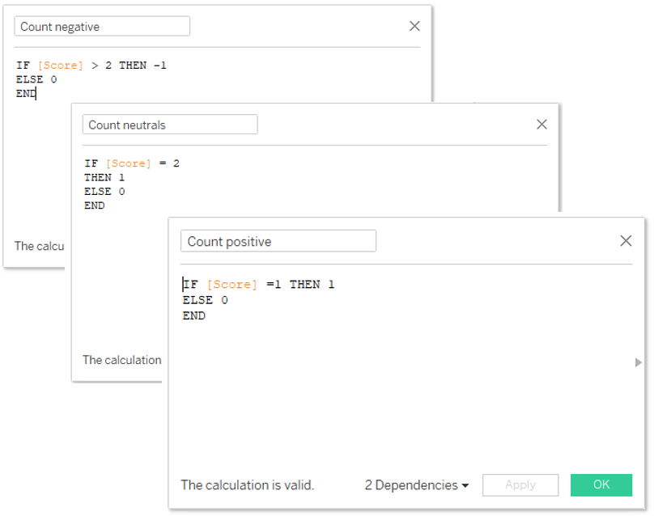
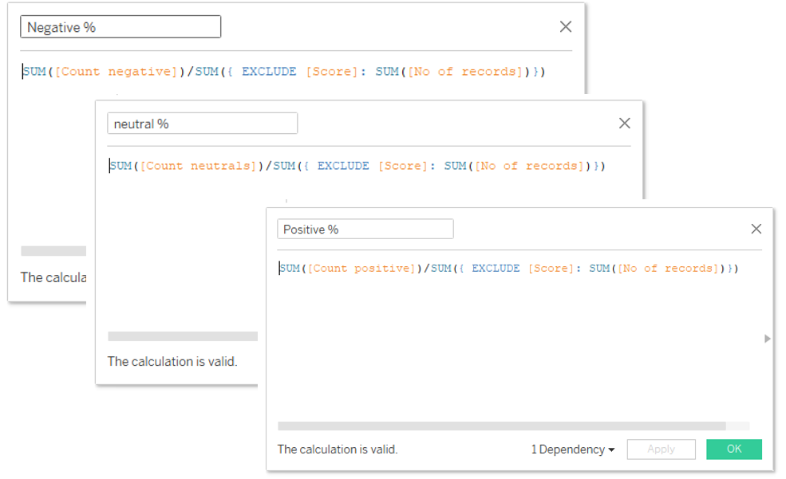
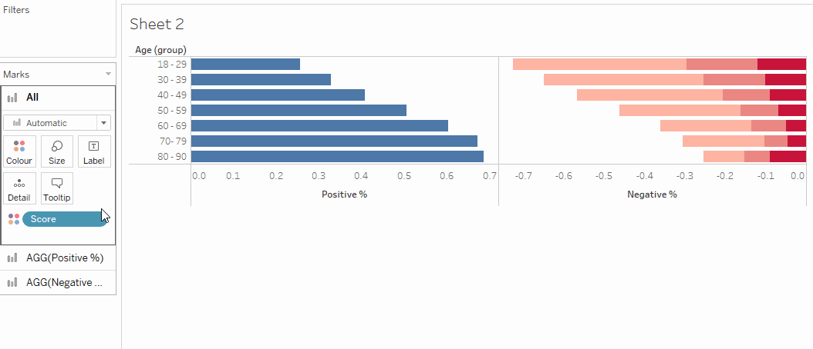
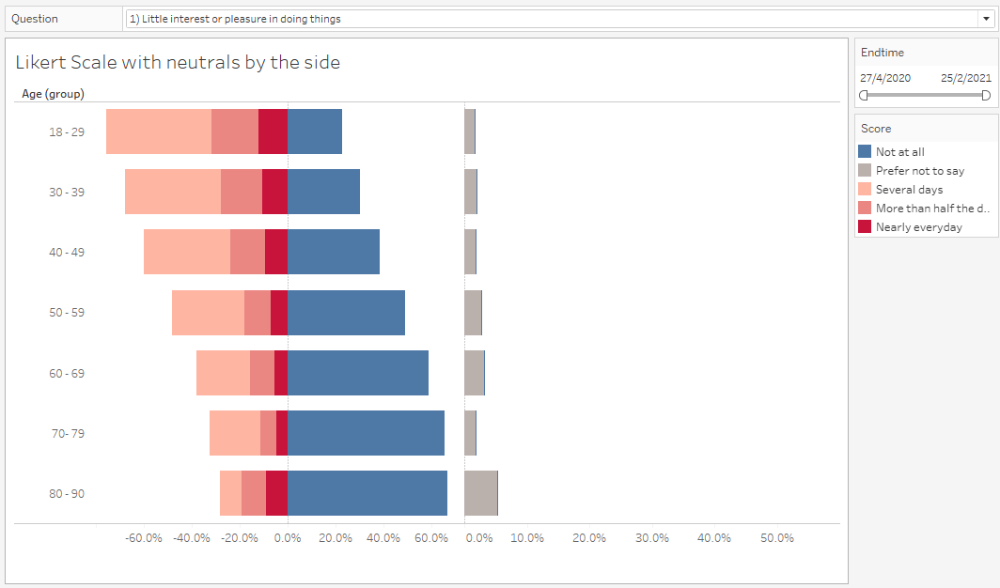
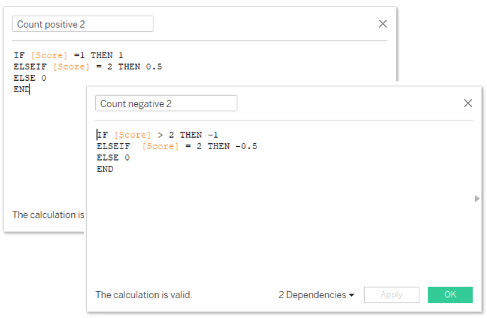
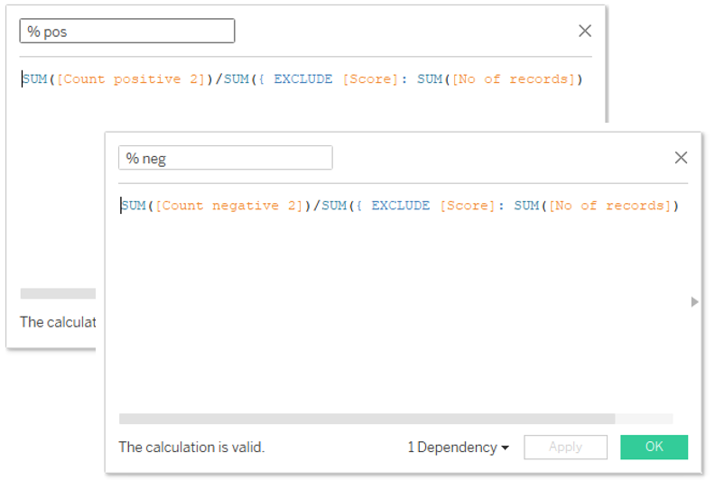

---

*Documenting my Tableau learning journey.*

---

## Likert Scale

Survey on mental wellness in Singapore.

<noscript></noscript><object class='tableauViz'  style='display:none;'><param name='host_url' value='https%3A%2F%2Fpublic.tableau.com%2F' /> <param name='embed_code_version' value='3' /> <param name='site_root' value='' /><param name='name' value='Likertscalechart_SurveyonmentalwellnessinSingapore&#47;Dashboard1' /><param name='tabs' value='no' /><param name='toolbar' value='yes' /><param name='static_image' value='https:&#47;&#47;public.tableau.com&#47;static&#47;images&#47;Li&#47;Likertscalechart_SurveyonmentalwellnessinSingapore&#47;Dashboard1&#47;1.png' /> <param name='animate_transition' value='yes' /><param name='display_static_image' value='yes' /><param name='display_spinner' value='yes' /><param name='display_overlay' value='yes' /><param name='display_count' value='yes' /><param name='language' value='en' /></object>
                

Full visualisation available on [Tableau Public](https://public.tableau.com/profile/suyiinang#!/vizhome/likert_16153800261360/Dashboard1?publish=yes).  

## Good for
Analysing survey data

## How to create - step by step
I have used the Covid-19 tracker data for Singapore from [YouGov](https://github.com/YouGov-Data/covid-19-tracker).

**Data Cleaning - MS Excel**

As there are quite a number of survey questions, I have only retained 4 questions relating to mental health (PHQ questions) and some demographic data.

Blank observations were removed from my final dataset.

**Data Preparation - Tableau**

1) Pivot data
    

2) Rename headers 
    

3) Create score 
    

4) Create alias for score
    

5) Create alias for Question
    

6) Create age group
   

### Likert Scale with neutrals by the side
1) Create calculated fields
- No of records

   

- Count positive/negative/neutral
Due to the nature of the responses, I have categorised the responses 3 types of sentiments:
|Sentiments| Responses|
|----|-----|
| Positive | Not at all|
| Neutral | Prefer not to say |
| Negative | Several days, More than half the days, Nearly everyday |

   

- Sentiment percentage

   

2) Arrange variables
   

3) Change chart type to "Bar", Select dual axis and synchronize axis, remove measure names.
   

4) Add neutral %
   

5) Fix axis of neutrals to align both charts
   

6) Format chart according to preference.

Here you have a likert scale chart with neutrals by the side. 
   

However, given that the percentage of neutrals are relatively small, it may be more meaningful to have neutrals between the positive and negative responses

### The usual likert scale
1) Create calculated fields
- Count positive/negative/neutral

   

- Sentiment percentage

   

2) Put it together
   

3) Repeat step 3 as mentioned above - Change chart type to "Bar", Select dual axis and synchronize axis, remove measure names.

4) Sort % score accordingly.
   

There you have a likert scale chart!

## Adding some interactivity
1) Add [Question] and [Endtime] to Filters. Select show filter for both.

For Question - select Single Value (dropdown) for [Endtime] select Range of Dates.

   

# And.. there you have it! Likert scale showcasing survey results.
   

---
I would like to thank Prof Kam of Singapore Management University for the inspiration.
